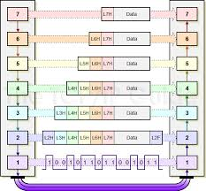

# Networking concepts Interview Question
## [Protocols]
* **IP**(Internet Protocol): IP is designed explicitly as addressing protocol. It is mostly used with TCP. The IP addresses in packets help in routing them through different nodes in a network until it reaches the destination system. 
    * connection-less, unreliable protocol designed to be ysed in a connection-less packet switched network such as the Internet.
    * no guarantee of delivery of error-free packets, ordered delivery of packets and delivery of packets(e.g. some will be lst or duplicated), IP relies on transport layer(TCP) to take care of these.
* **TCP**: Transmission Control Protocol. TCP is a popular communication protocol which is used for communicating over a network. It divides any message into series of packets that are sent from source to destination and there it gets reassembled at the destination.
* **UDP**: User Datagram Protocol. UDP is a substitute communication protocol to Transmission Control Protocol implemented primarily for creating loss-tolerating and low-latency linking between different applications.
* **FTP**: *File Transfer Protocol*. FTP allows users to transfer files from one machine to another. Types of files may include program files, multimedia files, text files, and documents, etc. **Port 21**
* **HTTP**: Hyper Text Transfer Protocol. HTTP is designed for transferring a hypertext among two or more systems. HTML tags are used for creating links. These links may be in any form like text or images. HTTP is designed on Client-server principles which allow a client system for establishing a connection with the server machine for making a request. The server acknowledges the request initiated by the client and responds accordingly.
* **HTTPs**: Hyper Text Transfer Protocol Secure. HTTPS is abbreviated as Hyper Text Transfer Protocol Secure is a standard protocol to secure the communication among two computers one using the browser and other fetching data from web server. HTTP is used for transferring data between the client browser (request) and the web server (response) in the hypertext format, same in case of HTTPS except that the transferring of data is done in an encrypted format. So it can be said that https thwart hackers from interpretation or modification of data throughout the transfer of packets.
* **SMTP**: Simple mail transport Protocol. SMTP is designed to send and distribute outgoing E-Mail.
* **POP**: Post office Protocol. POP3 is designed for receiving incoming E-mails.
* **SSH**: Secure Shell. SSH allows for remote command-line login and remote execution. It has many of the functions of FTP but is more secure.
* **Telnet**: Telnet is a set of rules designed for connecting one system with another. The connecting process here is termed as remote login. The system which requests for connection is the local computer, and the system which accepts the connection is the remote computer.
* **ARP**: Address Resolution Protocol.  It's used to find LAN address from the network address. It helps a node to send a frame over a local link. The node send a broadcast message to all nodes "What is the MAC address of this ip address". Node with the provided ip address replies with MAC address.
* **DHCP**: 
* **Sliding Window Protocols**: Sliding window protocols are **data link layer protocols** for reliable and sequential delivery of data frames. The sliding window is also used in **Transmission Control Protocol**. In this protocol, multiple frames can be sent by a sender at a time before receiving an acknowledgment from the receiver. The term sliding window refers to the imaginary boxes to hold frames.
    - Types: Sliding Window ARQ(Automatic Repeat req uest) 
        * **Go – Back – N ARQ**: sending multiple frames before receiving the acknowledgment for the first frame. The frames are sequentially numbered and a finite number of frames are sent. If the acknowledgment of a frame is not received within the time period, all frames starting from that frame are retransmitted.
        * **Selective Repeat ARQ**: sending multiple frames before receiving the acknowledgment for the first frame. However, here only the erroneous or lost frames are retransmitted, while the good frames are received and buffered.
    - TCP Window Size Scaling: TCP uses “windowing” which means that a sender will send one or more data segments and the receiver will acknowledge one or all segments. When the receiver sends an acknowledgment, it will tell the sender how much data it can transmit before the receiver will send an acknowledgment. We call this the window size. Basically, the window size indicates the size of the receive buffer. Typically the TCP connection will start with a small window size and every time when there is a successful acknowledgement, the window size will increase. 
* **Stop and wait protocol**: sender sends one frame, waits until it receives confirmation from the receiver (okay to go ahead), and then sends the next frame.
* **MAC protocal**: medium access control. Within the data link layer, the LLC provides flow control and multiplexing for the logical link (i.e. EtherType, 802.1Q VLAN tag etc), while the MAC provides flow control and multiplexing for the transmission medium. 
    * Channel partitioning: divide channel into small pieces(time slots, frequency) TDMA, FDMA, CDMA
    * Random Access: Channel not divided and allow collisions. ALOHA, CSMA/CD(Carrier Sense Multiple access with collison detection, IEEE802.3), CSMA/CA(Collison avoidance)
    * Controlled-asssess: Nodes take turn. Reservation, polling, token passing(IEEE802.5)
### 1. What is the difference between TCP and UDP? When would you use each of them?
TCP|UDP
--|--
TCP stands for **Transmission control protocol**|UDP stands for **User datagram protocol**
The unit of data is called a **segment** | The unit of data is called a **datagram**
TCP is **connection-oriented** protocol means before sending data, there is connection establishment happens between two clients|UDP is **connectionless **protocol means there is no connection establishment before sending data between two clients
TCP provides **reliable** communication, in-order byte-stream data transfer. For loss, there is acknowledgements and retransmissions|UDP provides **unreliable** communiation
TCP gives guarantee of transmission of data|UDP does not give guarantee of transmission of data.
TCP header size is 20 bytes|UDP header size is 8 bytes
In TCP there is concept of **acknowledgment**|In UDP there is no concept of acknowledgment
there is **error, flow control**, sender won't overwhelm receiver |there is no **error, flow control**
there is **congestion control**, senders "slow down sending rate" when network congested|there is no **congestion control**
TCP has concern of jitter. Means if any packet lost then TCP does not provide subsequent data to the application while it is requesting re-sending of the missing data|UDP does not have concern of jitter because there is retransmission of missing data.
TCP is slower as compared to UDP because retransmission of lost packets can take long delay.|UDP is faster as compared to TCP because there is no retransmission of lost packets
App's using: HTTP(web), FTP(file transfer), Telnet(remote login), SMTP(email) | App's using: streaming media, teleconferencing, DNS, SNMP, RIP, Voice over IP (VoIP)

* Both UDP and TCP provide error checking.

### 2. What are request methods in HTTP?
HTTP denotes Hyper Text Transfer Protocal, port#80, responsible for web context.
- **GET**- It is used to send data in url.
- **HEAD**- It only transfers status line and header section as a request.
- **POST**- It is used to send data to the server.
- **PUT**- It is used to send entire updated data to the server. 
- **DELETE**- Delete method sends a request to the server to perform delete operation.
- **CONNECT**- It is used to establish connection to the server.
- **OPTIONS**- Option method describes communication options for target resource.
- **TRACE**- It performs message loop-back test along the path to the target resource.

### 3. What is status code in HTTP?
4xx Client Error/5xx Server Error
- **500** internal server errors: Web server displays 500 internal server error, when processing fails due to some unanticipated incident on the server side. 
- **505** HTTP Version NO Supported
- **409** : When we use PUT request to create the same resource twice then server displays 409 code to the browser.
- **405**Method not allowed: Web Server displays the HTTP 405 error message, when requested method is not allowed. Ex. if a resource allows get method, we cannot request post to get this resource.
- **401**: This response code is generated when an unauthorized user request for secure resource on the web server.
- **403**: Forbidden Error. when a web server forbids you from accessing the page you’re trying to open in your browser.
- **404** Not found: requested document not found on this server
- **400** Bad Request: request msg nit understood by server
- **301** Moved Permanently: requested object moved, new location specified later in this msg(Location:)
- **201** Created: This indicates that the request was successful. It is used to confirm success of a PUT or POST request.
- **200** OK: It indicates that the request is successful.

### 4. Common ports
* HTTP – Port 80.
* HTTPS – 443.
* FTP – 21.
* FTPS / SSH – 22.
* POP3 – 110.
* POP3 SSL – 995.
* IMAP – 143.
* IMAP SSL – 993.
* DNS - 53
* Telnet - 23: Remote login service, unencrypted text messages
* DHCP - for server is 67 and for the client is 68.

### 5. HTTP vs HTTPS 
* In HTTP, URL begins with “http://” whereas URL starts with “https://”
* HTTP uses port number 80 for communication and HTTPS uses 443
* HTTP is considered to be unsecure that vulnerable to hackers and HTTPS is secure. It Is highly secure as the data is encrypted before it is seen across a network.
* HTTP Works at Application Layer and HTTPS works at Transport Layer
* HTTPS websites use data encryption. HTTP transfers data in plain text while HTTPS transfers data in cipher text (encrypt text).
* HTTPs is slower than HTTP
* HTTP does not require any certificates and HTTPS needs SSL Certificates

### Network security protocols
* Network security protocols are primarily designed to prevent any unauthorized user, application, service or device from accessing network data. This applies to virtually all data types regardless of the network medium used.
* Network security protocols generally implement cryptography and encryption techniques to secure the data so that it can only be decrypted with a special algorithm, logical key, mathematical formula and/or a combination of all of them. Some of the popular network security protocols include Secure File Transfer Protocol (SFTP), Secure Hypertext Transfer Protocol (HTTPS) and Secure Socket Layer (SSL).

### 6. SSL
SSL is the secure socket layer, a cryptographic protocol to encrypt network traffic. HTTPS is HTTP over SSL.
1) How is SSL related to HTTPs
HTTPS takes the well-known and understood HTTP protocol, and simply layers a SSL/TLS (hereafter referred to simply as “SSL”) encryption layer on top of it. Servers and clients still speak exactly the same HTTP to each other, but over a secure SSL connection that encrypts and decrypts their requests and responses. The SSL layer has 2 main purposes:
    * Verifying that you are talking directly to the server that you think you are talking to
    * Ensuring that only the server can read what you send it and only you can read what it sends back
2) SSL handshakes
* It takes place whenever a user navigates to a website over HTTPS and the browser first begins to query the website's origin server.
* It also happens whenever any other communications use HTTPS, including API calls and DNS over HTTPS queries.
* It occurs after a TCP connection has been opened via a TCP handshake.
<details>
<summary> handshakes process</summary>
<br>1. The SSL or TLS client sends a client hello message that lists cryptographic information such as the SSL or TLS version and, in the client's order of preference, the CipherSuites supported by the client. The message also contains a random byte string that is used in subsequent computations. The protocol allows for the client hello to include the data compression methods supported by the client.
<br>2. The SSL or TLS server responds with a server hello message that contains the CipherSuite chosen by the server from the list provided by the client, the session ID, and another random byte string. The server also sends its digital certificate. If the server requires a digital certificate for client authentication, the server sends a client certificate request that includes a list of the types of certificates supported and the Distinguished Names of acceptable Certification Authorities (CAs).
<br>3. The SSL or TLS client verifies the server's digital certificate. For more information, see How SSL and TLS provide identification, authentication, confidentiality, and integrity.
<br>4. The SSL or TLS client sends the random byte string that enables both the client and the server to compute the secret key to be used for encrypting subsequent message data. The random byte string itself is encrypted with the server's public key.
<br>5. If the SSL or TLS server sent a client certificate request, the client sends a random byte string encrypted with the client's private key, together with the client's digital certificate, or a no digital certificate alert. This alert is only a warning, but with some implementations the handshake fails if client authentication is mandatory.
<br>6. The SSL or TLS server verifies the client's certificate. For more information, see How SSL and TLS provide identification, authentication, confidentiality, and integrity.
<br>7. The SSL or TLS client sends the server a finished message, which is encrypted with the secret key, indicating that the client part of the handshake is complete.
<br>8. The SSL or TLS server sends the client a finished message, which is encrypted with the secret key, indicating that the server part of the handshake is complete.
<br>9. For the duration of the SSL or TLS session, the server and client can now exchange messages that are symmetrically encrypted with the shared secret key.
</details>


### DHCP
<details>
<summary>What id DHCP?</summary>
The work of DHCP is to assign an IP address to the hosts. Dynamic Host Configuration Protocol(DHCP) is an application layer protocol. It is a Client server protocol which uses UDP services. IP address is assigned from a pool of addresses. DHCP port number for server is 67 and for the client is 68.
</details>
<details>
<summary>How DHCP Works</summary>
 <br>Device sends broadcast message "I am new here". DHCP server see message and responde and allocate an IP address, while other devices ignore the message.
 <br>In DHCP, the client and the server exchange mainly 4 DHCP messages in order to make a connection, also called DORA process, but there are 8 DHCP messages in the process.
</details>
<details>
<summary>DHCP DORA Process</summary>
 <br>* Discovery ( DHCP discover ):
 <br>By this message interaction start between server and client. Discovery sent by a client that is connected to a local subnet. While send discovery destination address is broadcast 255.255.255.255 and source address is 0.0.0.0.
  <br>* OFFER ( DHCP offer ):
  <br>Offer is a response to the Discovery message by the DHCP server to the DHCP clients. It contains a network configuration setting for the client like an IP address offered to client 10.1.1.1.
  <br>* REQUEST ( DHCP request ):
 Response to Offer is indicating that the client has accepted the network configuration. It means to accept the offer by the DHCP server with IP 10.1.1.1. this message sent by the client with destination address 255.255.255.255 and the source address is 10.1.1.1.
  <br>* ACKNOWLEDGE ( DHCP ack ):
 After the request message or accept the IP by DHCP SERVER, the server sent an ACK to the client. This message clear to the client that now you can start using the network.
</details>

## [Models]
### 1. Explain the seven layers of the OSI reference model. / What are layers in OSI model?
**OSI model** stands for Open System Interconnection. It’s a reference model which describes that how different applications will communicate to each other over the computer network.

Name | Details  | Protocols involved | Data units
--|--|--|--
**Physical Layer** | It is responsible for the actual physical connection between the devices.When receiving data, this layer will get the signal received and convert it into 0s and 1s and send them to the Data Link layer, which will put the frame back together. |PON, OTN, DSL, IEEE.802.11, IEEE.802.3, L431 and TIA 449.| bits, symble
**Datalink Layer** | is responsible for the node to node delivery of the message. The main function of this layer is to make sure data transfer is error-free from one node to another, over the physical layer. DLL encapsulates Sender and Receiver’s MAC address in the header. Data Link Layer is divided into two sub layers : Logical Link Control (LLC) & Media Access Control (MAC) |ARP, CSLIP, HDLC, IEEE.802.3, PPP, X-25, SLIP, ATM, SDLS and PLIP| Frame
**Network Layer**| transmission of data from one host to the other located in different networks. It also takes care of packet routing. The sender & receiver’s IP address are placed in the header by the network layer. |Internet Protocol (IPv4), Internet Protocol (IPv6), IPX, AppleTalk, ICMP, IPSec and IGMP.|Packet
**Transport Layer**| responsible for the End to End Delivery of the complete message. The transport layer also provides the acknowledgement of the successful data transmission and re-transmits the data if an error is found.|TCP, UDP, SPX, DCCP and SCTP| Segments, Datagram
**Session Layer**| responsible for establishment of connection, maintenance of sessions, authentication and also ensures security.|PPTP, SAP, L2TP and NetBIOS|data
**Presentation Layer**|The data from the application layer is extracted here and manipulated as per the required format to transmit over the network.|XDR, TLS, SSL and MIME|data
**Application Layer**|These applications produce the data, which has to be transferred over the network. This layer also serves as a window for the application services to access the network and for displaying the received information to the user.|HTTP(via a web browser), SMTP(via an email client), DHCP, FTP(via an FTP client), Telnet|data

### 2. Explain TCP/IP Model
* The most widely used and available protocol is TCP/IP i.e. Transmission Control Protocol and Internet Protocol. TCP/IP specifies how data should be packaged, transmitted and routed in their end to end data communication.
* Given below is a brief explanation of each layer:
    * **Application Layer**: This is the top layer in the TCP/IP model. It includes processes that use Transport Layer Protocol to transmit the data to their destination. There are different Application Layer Protocols such as HTTP, FTP, SMTP, SNMP protocols, etc.
    * **Transport Layer**: It receives the data from the Application Layer which is above the Transport Layer. It acts as a backbone between the host's system connected with each other and it mainly concerns about the transmission of data. TCP and UDP are mainly used as Transport Layer protocols.
    * **Network or Internet Layer**: This layer sends the packets across the network. Packets mainly contain source & destination IP addresses and actual data to be transmitted.
    * **Network Interface Layer**: It is the lowest layer of the TCP/IP model. It transfers the packets between different hosts. It includes encapsulation of IP packets into frames, mapping IP addresses to physical hardware devices, etc.
    
### 3. Data transmission

1) An application, such as an email program, creates data that will be sent by an end user, such as an email message. The Application layer (layer 7) places a header (encapsulation) field that contains information such as screen size and fonts, and passes the data to the Presentation layer (layer 6).
2) The Presentation layer places layer 6 header information. For example, the text in the message might be converted to ASCII. The Presentation layer will then pass the new data to the Session layer (layer 5).
3) The Session layer follows the same process by adding layer 5 header information, such as information that the Session layer will manage the data flow, and passes this data to the Transport layer (layer 4).
4) The Transport layer places layer 4 information, such as an acknowledgment that the segment was received in the header, and passes it to the Network layer (layer 3).
5) The Network layer places layer 3 header information, such as the source and destination address so the Network layer can determine the best
6) The Data Link layer places layer 2 **header and trailer** information, such as a Frame Check Sequence (FCS) to ensure that the information is not corrupt, and passes this new data to the Physical layer (layer 1) for transmission across the media.
7) The bit stream is then transmitted as ones and zeros on the Physical layer. It is at this point that the Physical layer ensures bit synchronization. Bit synchronization will ensure the end user data is assembled in the correct order it was sent.
8) Steps 1 through 7 occur in reverse order on the destination device. Device B collects the raw bits from the physical wire and passes them up the
### 4. Data Link Layer
* Unit of Data: frame
* Error detection
* Error control & Flow Control
    * Stop-and-Wait ARQ
    * Sliding Window ARQ
        * Gp-back-N ARQ
        * Selective-reject ARQ
        
### 4. What's MTU?
* A **maximum transfer unit (MTU)** is the maximum size of the data field(payload) in the frame. 
* If packet size > MTU, need for fragmentation for IP datagram.
    * Fragmentation: Identification(16bits) + flags(3bits) + fragmentation Offset(13 bits)
* The Internet's Transmission Control Protocol (TCP) uses the MTU to determine the maximum size of each packet in any transmission.

### 5. IP addresses
* Classful IP addressing
    * Class A: 0*******.X.X.X
    * Class B: 10******.X.X.X
    * Class C: 110*****.X.X.X
    * Class D: 1110****.X.X.X
    * Class E: 1111****.X.X.X
* Classless(concept of blocks): a.b.c.d/n
    * subnet masking: 32-bit pattern having a "1" in every netid and subnetid locations and a "0" in every hostid location
    * Subnetting: a process of creating multiple segments within IP network address space(netid, subnetid, hostid)
* Special IP Addresses(e.g. All 1's --> limited broadcast address)
* Private IP Addresses. They are non-routable.
10.0.0.0-10.255.255.255<br>
172.16.0.0-172.31.255.255<br>
192.168.0.0-192.168.255.255
* IPv4 is 32-Bit IP address whereas IPv6 is a 128-Bit IP address. IPv4 is a numeric addressing method whereas IPv6 is an alphanumeric addressing method. IPv4 uses ARP (Address Resolution Protocol) to map to MAC address whereas IPv6 uses NDP (Neighbour Discovery Protocol) to map to MAC address.
* regular expression for IP address.
^(([0-9]|[1-9][0-9]|1[0-9]{2}|2[0-4][0-9]|25[0-5])\.){3}([0-9]|[1-9][0-9]|1[0-9]{2}|2[0-4][0-9]|25[0-5])$

### 6. NAT: Network Address Translation
* Network Address Translation (NAT) is the ability of a router to translate a public IP address to a private IP address and vice versa.  It adds security to the network by keeping the private IP addresses hidden from the outside world.
* three NAT types
    * Open NAT - This means that your gaming console has the ability to connect to anyone’s games, host games, and other users will be able to find and connect to the game you are hosting.
    * Moderate NAT - This means that your connectivity to other players is neither limited nor open.  You will be able to connect to other players but some functions will be limited.
    * Strict NAT - This means that you have limited connectivity with other players and players who have Strict or Moderate NAT will not be able to join your gaming session.
### 6. MAC address
MAC addresses are 6-byte (48-bits) in length, and are written in MM:MM:MM:SS:SS:SS format.
* What's the MAC address in the TCP packet when your destination is Google.com?
Gateway's MAC address
* 如果我有几个network，路由上有静态路由，客户端如何判断应该去哪个？
取决于哪个静态路由cover了client要访问的网络，also metric and prefix size matters 

### 5. TCP Connection set-up? Three-way handshake? TCP Synchronisation
Client ------SYN-----> Server<br>
Client <---ACK/SYN---- Server ----①<br>
Client ------ACK-----> Server<br>
* The client sends a TCP SYNchronize packet to Server
* Server receives client’s SYN
* Server sends a SYNchronize+ACKnowledgement
* Client receives Server’s SYN-ACK
* Client sends ACKnowledge
* Server receives ACK.
* TCP socket connection is ESTABLISHED.

### 6. TCP connection termination? four-way handshake
Client ------FIN-----> Server<br>
Client <-----ACK------ Server ----②<br>
Client <-----FIN------ Server ----③<br>
Client ------ACK-----> Server<br>

## [Others]
### 1. Describe in as much details as possible what happens after we type "www.google.com" into the URL box of browser and hit enter. / What happens when you type a URL in the web browser?
- Step 1. URL is typed in the browser.
- Step 2. If requested object is in browser cache and is fresh, move on to Step  8.
- Step 3. DNS lookup to find the ip address of the server. Browser first looks up URL-ip mapping browser cache, then in OS cache. If all empty, then make a recursive query to local DNS server(provide ip address).
- Step 4. Browser initiates a TCP connection with the server using three way handshake.
- Step 5. Browser sends a HTTP request to the server.
- Step 6. Server handles the incoming HTTP request and sends an HTTP response.
- Step 7. Browser receives the HTTP response
- Step 8. Browsers renders and displays the html content 
- Step 9. Client interaction with server

### 2. What are cookies? Why do we need it?
**Cookies** are small pieces of information stored on the client computer. Use cookies to store small amounts of information on the client's machine. Web sites often use cookies to store user preferences or other information that is client specific.
- **Session Cookies**: stored **in-memory** during the client browser session. When the browser is closed the session, cookies are lost.
- **Persistent Cookies**:  same as Session Cookies except that, persistent cookies have an **expiration date**. The expiration date indicates to the browser that it should write the cookie to the client's hard drive.
**[Adv. ]**
1. Cookies do not require any server resources since they are stored on the client.
2. Cookies are easy to implement.
3. You can configure cookies to expire when the browser session ends (session cookies) or they can exist for a specified length of time on the client computer (persistent cookies).
**[DisAdv.]**
1. User can delete a cookie
2. User browser can refuse cookies
3. Cookies exit as plain text on client machine and they may pose a security rist as anyone can open the cookie.

### 3. Difference between Hub, Switch and Router?
* A **hub** is to sent out a message from one port to other ports. For example, if there are three computers of A, B, C, the message sent by a hub for computer A will also come to the other computers. But only computer A will respond and the response will also go out to every other port on the hub. Therefore, all the computers can receive the message and computers themselves need to decide whether to accept the message. works on the physical layer (Layer 1) of OSI model
* A switch is able to handle the data and knows the specific addresses to send the message. It can decide which computer is the message intended for and send the message directly to the right computer.  works on the data link layer (Layer 2)
* Router is actually a small computer that can be programmed to handle and route the network traffic. It usually connects at least two networks together. Routers can calculate the best route for sending data and communicate with each other by protocols.works in *network layer*(Layer 3 of the OSI Model)
* Collisions are often in a hub environment, because each port on a hub is in the same **collision domain**. By contrast, each port on a bridge, a switch or a router is in a separate collision domain.
* All ports on a hub or a switch are by default in the same **broadcast domain**. All ports on a router are in the different broadcast domains and routers don't forward broadcasts from one broadcast domain to another.

### 4. Router
1) Router function?
    * It forwards data packets toward their destination.
    * It acts as an intersection between multiple IP networks.
2) Routing Protocols
A routing protocol specifies how routers communicate with each other, distributing information that enables them to select routes between any two nodes on a computer network.
    * RIP(Routing Information Protocol): It enabled routers discover the network by first sending a message requesting router tables from neighboring devices. Neighbor routers running RIP respond by sending the full routing tables back to the requestor, whereupon the requestor follows an algorithm to merge these updates into its own table. 
    * OSPF(Open Shortest Path First): It enabled routers discover the network by sending identification messages to each other followed by messages that capture specific routing items rather than the entire routing table. It is the only link-state routing protocol listed in this category. 
        * An OSPF network can be divided into sub-domains called **areas**. An area is a logical collection of OSPF networks, routers, and links that have the same area identification. A router within an area must maintain a topological database for the area to which it belongs.
        * OSPF LSA Types: LSA Type 1: Router LSA. LSA Type 2: Network LSA. LSA Type 3: Summary LSA. LSA Type 4: Summary ASBR LSA. LSA Type 5: Autonomous system external LSA. LSA Type 6: Multicast OSPF LSA. LSA Type 7: Not-so-stubby area LSA. LSA Type 8: External attribute LSA for BGP.
    * IS-IS(Intermediate System to Intermediate System): IS-IS does not run over Internet Protocol (IP) and uses its own addressing scheme. 
    * BGP(Border Gateway Protocol ): an **exterior gateway protocol (EGP)**. Basically, interior protocols are meant to dynamically route data across a network that you fully control and maintain. Exterior routing protocols are used to exchange routes between distinctly separate networks that you have no administrative control over. BGP is the routing protocol used on the internet;  therefore, the most common enterprise use is to run BGP on your internet edge when connecting to your ISP.
        * six states:Idle, Connect, Active, Opensent, Openconfirm, Established. In the "Idle" state, BGP initializes all resources, refuses all inbound BGP connection attempts and initiates a TCP connection to the peer. The second state is "Connect". In the "Connect" state, the router waits for the TCP connection to complete and transitions to the "OpenSent" state if successful. If unsuccessful, it starts the ConnectRetry timer and transitions to the "Active" state upon expiration. In the "Active" state, the router resets the ConnectRetry timer to zero and returns to the "Connect" state. In the "OpenSent" state, the router sends an Open message and waits for one in return in order to transition to the "OpenConfirm" state. Keepalive messages are exchanged and, upon successful receipt, the router is placed into the "Established" state. In the "Established" state, the router can send/receive: Keepalive; Update; and Notification messages to/from its peer.
3) Types of Routing
    * Static Routing: non-adaptive routing which doesn’t change routing table unless the network administrator changes or modify them manually. Static routing does not use complex routing algorithms and It provides high or more security than dynamic routing.
    * Dynamic Routing: adaptive routing which change routing table according to the change in topology. Dynamic routing uses complex routing algorithms and it does not provide high security like static routing. When the network change(topology) occurs, it sends the message to router to ensure that changes then the routes are recalculated for sending updated routing information.
    
### 4. What's DNS? what protocol it use? How DNS works(detail)? 
* DNS stands for **Domain Name System**. It translates domain names to IP addresses so browsers can load Internet resources. It works in a hierarchical way.
* It is an **application layer protocol** for message exchange between clients and servers. DNS primarily uses the **User Datagram Protocol (UDP)** on port number **53** to serve requests.
*  Process:
    * Step 1: Request information. <br>
      The process begins when you ask your computer to resolve a hostname, such as visiting https://dyn.com. The first place your computer looks for the corresponding IP address is its **local DNS cache**, which stores information that your computer has recently retrieved.</br> If your computer doesn’t already know the answer, it needs to perform a **DNS query** to find out. When host makes DNS query, query is sent to its local DNS server.
    * Step 2: Ask the recursive DNS servers.<br>
    your computer queries (contacts) the **recursive DNS servers** (resolvers) from your internet service provider (ISP). 
    * Step 3: Ask the root name servers.
    If the recursive servers don’t have the answer, they query the **root name servers**.
    * Step 4: Ask the TLD name servers.
    The root name servers will look at the first part of our request, reading from right to left — www.dyn.com — and in our case, direct our query to the **top-level domain** (TLD) name servers for .com.
    * Step 5: Ask the **authoritative DNS servers**.
    The TLD name servers review the next part of our request — www.dyn.com — and direct our query to the name servers responsible for this specific domain.
    * Step 6: Retrieve the record.
    The recursive server retrieves the A record for dyn.com from the authoritative name servers and stores the record in its local cache.
    * Step 7: Receive the answer. 
    Armed with the answer, recursive server returns the A record back to your computer. Your computer stores the record in its cache, reads the IP address from the record, then passes this information to your browser. The browser then opens a connection to the webserver and receives the website.
* What's the DNS record type for IPv6 entries?  
An AAAA (pronounced quad A) record is a DNS record that maps to an IPv6 address. AAAA records are available for customers using the No-IP Plus Managed DNS service. Currently, IP addresses are based on version 4 of the internet protocol, where there are 4 sets of numbers ranging from 0-255. For example (127.198.30.245). IPv6 has a much larger address space where there are 8 sets ranging from 0000-FFFF. For example (2001:0db8:0000:0000:0000:0000:1428:57ab).

### 5. What is a Proxy Server and how do they protect the computer network?
* For data transmission, IP addresses are required and even DNS uses IP addresses to route to the correct website. It means without the knowledge of correct and actual IP addresses it is not possible to identify the physical location of the network.
* Proxy Servers prevent external users who are unauthorized to access such IP addresses of the internal network. The Proxy Server makes the computer network virtually invisible to the external users.
* Proxy Server also maintains the list of blacklisted websites so that the internal user is automatically prevented from getting easily infected by viruses, worms, etc.

### 6. What are the different types of a network? Explain each briefly. (Network Classifications based on coverage)
* **Personal Area Network (PAN)**: It is the smallest and basic network type that is often used at home. It is a connection between the computer and another device such as phone, printer, modem tablets, etc
* **Local Area Network (LAN)**: LAN is used in small offices and internet cafes to connect a small group of computers to each other. Usually, they are used to transfer a file or for playing the game in a network.
* **Metropolitan Area Network (MAN)**: It is a powerful network type than LAN. The area covered by MAN is a small town, city, etc. A huge server is used to cover such a large span of area for connection.
* **Wide Area Network (WAN)**: It is more complex than LAN and covers a large span of the area typically a large physical distance. The Internet is the largest WAN which is spread across the world. WAN is not owned by any single organization but it has distributed ownership.
* **Storage Area Network (SAN)**
* **System Area Network (SAN)**
* **Enterprise Private Network (EPN)**
* **Passive Optical Local Area Network (POLAN)**

### 7. Networking Performance Measures
* **Delay/Latency(end-to-end)**
    * **Transmission time**, the time it takes ti transmit a group of bits(e.g. a message/packet/frame) of bits into a network<br>
    `Tt = number of message bits[bits] / data rate[bps]`
    * **Propagation delay**, the time it takes for a bit to tranverse the link
    `Tp = link length[m] / Vprop[m/s]`
    * **Nodal processing**: check bit errors and determine output link(routing decesion)
    * **Queuing delay**(Random, depends on network loading, link capacities, disciplines, etc...):  time waiting at output link for transmission, depends on congestion level of router
* **Throughput[bits/sec]**: The number of information bits that can be transferred reliably over a certain period of time.

### 8. Different Wi-Fi Protocols and Data Rates
IEEE 802.11 Wireless LANs(Wi-Fi) protocol summary:

Protocol | Frequency  | Channel Width   |   MIMO   |   Maximum data rate (theoretical)
-- | -- | -- | -- | --
802.11ax(6G)   |   2.4 or 5GHz    |  20, 40, 80, 160MHz  |    Multi User (MU-MIMO)    |  2.4 Gbps1
802.11ac wave2   |   5 GHz   |   20, 40, 80, 160MHz   |   Multi User (MU-MIMO)   |   1.73 Gbps2
802.11ac wave1(5G)   |   5 GHz   |   20, 40, 80MHz   |   Single User (SU-MIMO)   |   866.7 Mbps2
802.11n(4G) |    2.4 or 5 GHz   |   20, 40MHz   |   Single User (SU-MIMO)  |    450 Mbps3
802.11g(3G)  |    2.4 GHz    |  20 MHz   |   N/A   |   54 Mbps
802.11a(2G)  |    5 GHz   |   20 MHz  |    N/A    |  54 Mbps
802.11b(1G)  |    2.4 GHz    |  20 MHz    |  N/A   |   11 Mbps
Legacy 802.11  |    2.4 GHz   |   20 MHz   |   N/A   |   2 Mbps

## [network troubleshooting]
### 1. If your computer runs slow, how to troubleshout(linux server)?
* Because of some of the following reasons:
    * Many unnecessary services started or initialised at boot time by the init program
    * Many RAM consuming applications such as LibreOffice on your computer
    * Your (old) hard drive is malfunctioning, or its processing speed cannot keep up with the modern application
* To speed up:
    * Examine CPU information: cat /proc/cpuinfo
    * Check for services started at boot-time: service --status-all
    * Examine CPU Load: check whether your processor/CPU is overloaded with processes. (top)
    * Check for free memory space: RAM is where commonly used applications are usually stored. You can use the free command to check for memory information such as free space available for RAM and so on
    * Check if your hard drive is overworking
    
### 2. If you had no connection and thr address of 169.254 what does this means and how to solve the issue?
* Getting a 169.254.x.x address simply tells you the machine cannot reach the DHCP server over the network.
* 169.254.x.x: This is what's called an Automatic Private IP address. An IP in this range means that the computer cannot see the network. A computer using DHCP needs to have an external server tell it what IP address to use. Unfortunately, if there's no network connectivity, the computer is unable to talk to the server. In those cases, the computer will actually give itself an IP starting with 169.254, since it must assign itself some sort of number. When you see a 169.254.x.x address, you definitely have a problem. It could be as simple as an unplugged network cable, or it could be as complex as the network being down. A fair amount of troubleshooting is involved at this point, but the bottom line is that your computer doesn't even see the network.

### 3. Conmmands used to check Internet connection?
* PING servername/PING serverIP
* TRACERT servername/TRACERT serverIP

### 4. If a server failed to do a nightly backup, what could be a reason for that? 
* May be due to failure or mis-configuration of NTP Server.

### 5. When and why did you use wireshark?
* Wireshark is a free and open-source packet analyzer. It is used for network troubleshooting, analysis, software and communications protocol development, and education.
* Wireshark can peer inside the network and examine the details of traffic at a variety of levels, ranging from connection-level information to the bits comprising a single packet. This flexibility and depth of inspection allows the valuable tool to analyze security events and troubleshoot network security device issues.

### 6. How to Troubleshoot a Network
<details>
<summary>1. Check the hardware.</summary>
When you’re beginning the troubleshooting process, check all your hardware to make sure it’s connected properly, turned on, and working. If a cord has come loose or somebody has switched off an important router, this could be the problem behind your networking issues. There’s no point in going through the process of troubleshooting network issues if all you need to do is plug a cord in. Make sure all switches are in the correct positions and haven’t been bumped accidentally.
Next, turn the hardware off and back on again. This is the mainstay of IT troubleshooting, and while it might sound simplistic, often it really does solve the problem. Power cycling your modem, router, and PC can solve simple issues—just be sure to leave each device off for at least 60 seconds before you turn it back on.
</details>
<details>
<summary> 2. Use ipconfig</summary>
Open the command prompt and type “ipconfig” (without the quotes) into the terminal. The Default Gateway (listed last) is your router’s IP. Your computer’s IP address is the number next to “IP Address.” If your computer’s IP address starts with 169, the computer is not receiving a valid IP address. If it starts with anything other than 169, your computer is being allocated a valid IP address from your router.
Try typing in “ipconfig /release” followed by “ipconfig /renew” to get rid of your current IP address and request a new one. This will in some cases solve the problem. If you still can’t get a valid IP from your router, try plugging your computer straight into the modem using an ethernet cable. If it works, the problem lies with the router.
</details>
<details>
<summary> 3. Use ping and tracert</summary>
If your router is working fine, and you have an IP address starting with something other than 169, the problem’s most likely located between your router and the internet. At this point, it’s time to use the ping tool. Try sending a ping to a well-known, large server, such as Google, to see if it can connect with your router. You can ping Google DNS servers by opening the command prompt and typing “ping 8.8.8.8”; you can also add “-t” to the end (ping 8.8.8.8 -t) to get it to keep pinging the servers while you troubleshoot. If the pings fail to send, the command prompt will return basic information about the issue.
You can use the tracert command to do the same thing, by typing “tracert 8.8.8.8”; this will show you each step, or “hop,” between your router and the Google DNS servers. You can see where along the pathway the error is arising. If the error comes up early along the pathway, the issue is more likely somewhere in your local network.
</details>
<details>
<summary> 4. Perform a DNS check(nslookup)</summary>
Use the command “nslookup” to determine whether there’s a problem with the server you’re trying to connect to. If you perform a DNS check on, for example, google.com and receive results such as “Timed Out,” “Server Failure,” “Refused,” “No Response from Server,” or “Network Is Unreachable,” it may indicate the problem originates in the DNS server for your destination. (You can also use nslookup to check your own DNS server.)
</details>
<details>
<summary> 5. Contact the ISP</summary>
 If all of the above turn up no problems, try contacting your internet service provider to see if they’re having issues. You can also look up outage maps and related information on a smartphone to see if others in your area are having the same problem.
</details>
<details>
<summary> 6. Check on virus and malware protection</summary>
make sure your virus and malware tools are running correctly
</details>
<details>
<summary> 7. Review database logs</summary>
Review all your database logs to make sure the databases are functioning as expected.
</details>

## [Socket Programming]
A socet is an astract representation of a communication endpoint.  
A socket allows the application to "plug in" to the network and commnucate with other applications
A socket is uniquely identified by the IP address, Port number and the underlying transport layer protocol.

### 1. TCP Socket API
- **socket()**: specifying the type of communication protocol (TCP based on IPv4, TCP based on IPv6, UDP).
```#include <sys/socket.h>
 int socket (int family, int type, int protocol);
```
- **connect()**: is used by a TCP client to establish a connection with a TCP server
`int connect (int sockfd, const struct sockaddr *servaddr, socklen_t addrlen);`
- **bind()**: assign a port number to the socket
`int bind(int sockfd, const struct sockaddr *servaddr, socklen_t addrlen);`
- **listen()**: listen to connections frin clients
`int listen(int sockfd, int backlog);`
- **accept()**: get a socket for an incoming client connection
`int accept(int sockfd, struct sockaddr *cliaddr,socklen_t *addrlen);`
- **send()**: is similar to write() but allows to specify some options.
`ssize_t send(int sockfd, const void *buf, size_t nbytes, int flags);`
- **receive()**: is similar to read(), but allows to specify some options to control how the data are received.
`ssize_t recv(int sockfd, void *buf, size_t nbytes, int flags);`
- **close()**: close a socket and terminate a TCP socket. 
`int close(int sockfd);`

Establishing a TCP socket on the **client side** are the following:
- Create a socket using the `socket()` function;
- Connect the socket to the address of the server using the `connect()` function;
- Send and receive data by means of the `read()` and `write()` functions.
- Close the connection by means of the `close()` function.
<br>Establishing a TCP socket on the **Server side** are as follows:
- Create a socket with the `socket()` function;
- Bind the socket to an address using the `bind()` function;
- Listen for connections with the `listen()` function;
- Accept a connection with the `accept()` function system call. This call typically blocks until a client connects with the server.
- Send and receive data by means of `send()` and `receive()`.
- Close the connection by means of the `close()` function.

### 2. UDP Socket API
- **recvfrom()**: is similar to the read() function, but three additional arguments are required.
`ssize_t recvfrom(int sockfd, void* buff, size_t nbytes, int flags, struct sockaddr* from, socklen_t *addrlen);`
- **sendto()**: is similar to the send() function, but three additional arguments are required.
`ssize_t sendto(int sockfd, const void *buff, size_t nbytes,int flags, const struct sockaddr *to,socklen_t addrlen);`
Establishing a UDP socket communication on the **client side** are the following:
- Create a socket using the **socket()** function;
- Send and receive data by means of the **recvfrom()** and **sendto()** functions.
<br>Establishing a UDP socket communication on the **server side** are as follows:
- Create a socket with the **socket()** function;
- Bind the socket to an address using the **bind()** function;
- Send and receive data by means of **recvfrom()** and **sendto()**.

### 3. Difference between sendto and send functions.
These functions send data to a socket. Generally speaking, send() is used for TCP SOCK_STREAM connected sockets, and sendto() is used for UDP SOCK_DGRAM unconnected datagram sockets.

### 4. Basic CLI(command-line interface
* Print Working Directory (pwd) 
* Change Directories (cd) 
* List Files and Directories (ls) 
* Create Files (touch) 
* Creating Directories (mkdir) 
* Deleting Files (rm) 
* Move or Rename Files or Directories (mv)
* Copying Directories (cp)
* Clear Your CLI (clear)
* Manual Pages (man)
