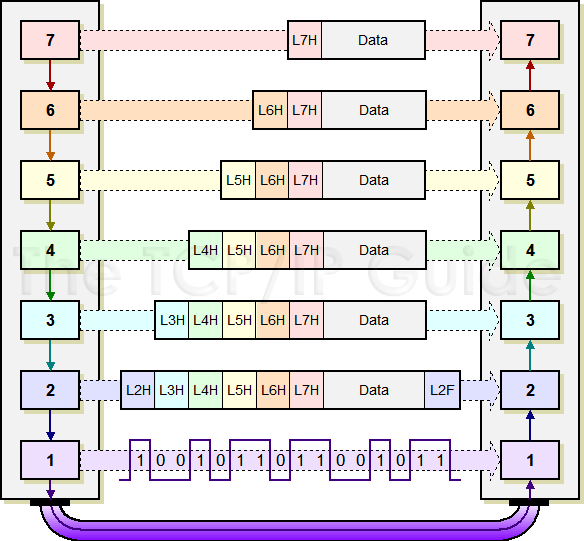
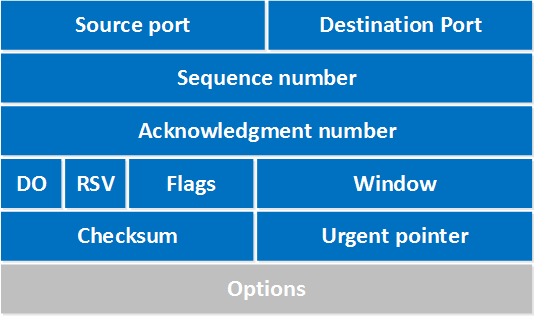
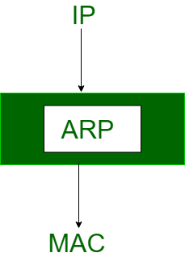

# Networking concepts Interview Question
* [Models](#firemodels)
* [Protocols](#fireProtocols)
* [Details](#fireDetails)
    * [MAC Address](#MACaddress)
    * [Router](#Router)

## [:fire:]()[Models]
### 1. Explain the seven layers of the OSI reference model. / What are layers in OSI model?
**OSI model** stands for Open System Interconnection. It’s a reference model which describes that how different applications will communicate to each other over the computer network.

Name | Details  | Protocols involved | Data units
--|--|--|--
**Physical Layer** | It is responsible for the actual physical connection between the devices.When receiving data, this layer will get the **signal** received and convert it into **0s and 1s** and send them to the Data Link layer, which will put the frame back together. |PON, OTN, DSL, IEEE.802.11, IEEE.802.3, L431 and TIA 449.| bits, symble
**Datalink Layer** | is responsible for the **node to node** delivery of the message. The main function of this layer is to make sure data transfer is **error-free** from one node to another, over the physical layer. **DLL** encapsulates *Sender and Receiver’s MAC address* in the header. Data Link Layer is divided into two sub layers : Logical Link Control (LLC) & Media Access Control (MAC) -- **Error detection, Error control & Flow Control**|[ARP](#ARP), CSLIP, HDLC, IEEE.802.3, PPP, X-25, SLIP, ATM, SDLS and PLIP| Frame
**Network Layer**| transmission of data from one **host** to the other located in different networks. It also takes care of **packet routing**. *The sender & receiver’s IP address* are placed in the header by the network layer. |[IP](#IP)(IPv4, IPv6), IPX, AppleTalk, [ICMP](#ICMP), [IPSec](#IPSec) and IGMP.|Packet
**Transport Layer**| responsible for the **End to End Delivery** of the complete message. The transport layer also provides the **acknowledgement** of the successful data transmission and **re-transmits** the data if an error is found.|[TCP&UDP](#TCPUDP), SPX, DCCP and SCTP| Segments, Datagram
**Session Layer**| responsible for **establishment of connection**, maintenance of sessions, authentication and also ensures security.|PPTP, SAP, L2TP and NetBIOS|data
**Presentation Layer**|The data from the application layer is extracted here and manipulated as per the required format to transmit over the network.|XDR, TLS, [SSL](#SSL) and MIME|data
**Application Layer**|These applications produce the data, which has to be transferred over the network. This layer also serves as a window for the application services to access the network and for displaying the received information to the user.|[HTTP](#HTTP), [SMTP](#SMTP), [DHCP](#DHCP), [FTP](#FTP), [Telnet](#Telnet)|data

### 2. Explain TCP/IP Model

* The most widely used and available protocol is TCP/IP i.e. Transmission Control Protocol and Internet Protocol. TCP/IP specifies how data should be packaged, transmitted and routed in their end to end data communication.
* Given below is a brief explanation of each layer:
    * **Application Layer**: This is the top layer in the TCP/IP model. It includes processes that use Transport Layer Protocol to transmit the data to their destination. There are different Application Layer Protocols such as HTTP, FTP, SMTP, SNMP protocols, etc.
    * **Transport Layer**: It receives the data from the Application Layer which is above the Transport Layer. It acts as a backbone between the host's system connected with each other and it mainly concerns about the transmission of data. TCP and UDP are mainly used as Transport Layer protocols.
    * **Network Layer**: This layer sends the packets across the network. Packets mainly contain source & destination IP addresses and actual data to be transmitted.
    * **Network Interface Layer**: It is the lowest layer of the TCP/IP model. It transfers the packets between different hosts. It includes encapsulation of IP packets into frames, mapping IP addresses to physical hardware devices, etc.
* Characteristics TCP/IP Model
    * Support for a flexible architecture
    * Adding more systems to a network is easy.
    * It can be operated independently. For OSI, Layers can't work in parallel as each layer need to wait to obtain data from the previous layer.
    
### 3. Data transmission
 
1) An application, such as an email program, creates data that will be sent by an end user, such as an email message. The Application layer (layer 7) places a header (encapsulation) field that contains information such as screen size and fonts, and passes the data to the Presentation layer (layer 6).
2) The Presentation layer places layer 6 header information. For example, the text in the message might be converted to ASCII. The Presentation layer will then pass the new data to the Session layer (layer 5).
3) The Session layer follows the same process by adding layer 5 header information, such as information that the Session layer will manage the data flow, and passes this data to the Transport layer (layer 4).
4) The Transport layer places layer 4 information, such as an acknowledgment that the segment was received in the header, and passes it to the Network layer (layer 3).
5) The Network layer places layer 3 header information, such as the source and destination address so the Network layer can determine the best
6) The Data Link layer places layer 2 **header and trailer** information, such as a Frame Check Sequence (FCS) to ensure that the information is not corrupt, and passes this new data to the Physical layer (layer 1) for transmission across the media.
7) The bit stream is then transmitted as ones and zeros on the Physical layer. It is at this point that the Physical layer ensures bit synchronization. Bit synchronization will ensure the end user data is assembled in the correct order it was sent.
8) Steps 1 through 7 occur in reverse order on the destination device. Device B collects the raw bits from the physical wire and passes them up

### 4. TCP Header

* **Source port**: this is a 16 bit field that specifies the port number of the sender.
* **Destination port**: this is a 16 bit field that specifies the port number of the receiver.
* **Sequence number**: a 32 bit field that indicates how much data is sent during the TCP session. When you establish a new TCP connection (3 way handshake) then the initial sequence number is a random 32 bit value. The receiver will use this sequence number and sends back an acknowledgment. 
* **Acknowledgment number**:  32 bit field is used by the receiver to request the next TCP segment. This value will be the sequence number incremented by 1.
* **DO**: this is the 4 bit data offset field, also known as the header length. It indicates the length of the TCP header so that we know where the actual data begins.
* **RSV**: these are 3 bits for the reserved field. They are unused and are always set to 0.
* **Flags**: there are 9 bits for flags, we also call them control bits. We use them to establish connections, send data and terminate connections:
    * **URG**: urgent pointer. When this bit is set, the data should be treated as priority over other data.
    * **ACK**: used for the acknowledgment.
    * **PSH**: this is the push function. This tells an application that the data should be transmitted immediately and that we don’t want to wait to fill the entire TCP segment.
    * **RST**: this resets the connection, when you receive this you have to terminate the connection right away. This is only used when there are unrecoverable errors and it’s not a normal way to finish the TCP connection.
    * **SYN**: we use this for the initial three way handshake and it’s used to set the initial sequence number.
    * **FIN**: this finish bit is used to end the TCP connection. TCP is full duplex so both parties will have to use the FIN bit to end the connection. This is the normal method how we end an connection.
* **Window**: the 16 bit window field specifies how many bytes the receiver is willing to receive. It is used so the receiver can tell the sender that it would like to receive more data than what it is currently receiving. It does so by specifying the number of bytes beyond the sequence number in the acknowledgment field.
* **Checksum**: 16 bits are used for a checksum to check if the TCP header is OK or not.
* **Urgent pointer**: these 16 bits are used when the URG bit has been set, the urgent pointer is used to indicate where the urgent data ends.
* **Options**: this field is optional and can be anywhere between 0 and 320 bits.

## [:fire:]()[Protocols]
### Common ports
* HTTP – Port 80.
* HTTPS – 443.
* FTP – 21.
* FTPS / SSH – 22.
* POP3 – 110.
* POP3 SSL – 995.
* IMAP – 143.
* IMAP SSL – 993.
* DNS - 53
* Telnet - 23: Remote login service, unencrypted text messages
* DHCP - for server is 67 and for the client is 68.
___
### ARP

* The **address resolution protocol** (arp) is a protocol used by the Internet Protocol (IP), specifically IPv4, to map IP network addresses to the hardware addresses used by a data link protocol. The protocol operates below the network layer as a part of the interface between the OSI network and OSI link layer. It is used when IPv4 is used over Ethernet.
* ARP finds the hardware address, also known as [Media Access Control (MAC) address](#mac-address), of a host from its known IP address.
___
### IP 
IP(**Internet Protocol**) is designed explicitly as addressing protocol. It is mostly used with TCP. The IP addresses in packets help in routing them through different nodes in a network until it reaches the destination system. 
* **Connection-less**, **unreliable** protocol designed to be used in a connection-less packet switched network such as the Internet.
* No guarantee of delivery of error-free packets, ordered delivery of packets and delivery of packets(e.g. some will be lost or duplicated), IP relies on transport layer(TCP) to take care of these.
* IP addresses
    * **Classful IP addressing**
        * Class A: 0*******.X.X.X(1-126)--network,node,node,node (0 and 127 are reserved)
        * Class B: 10******.X.X.X(128-191)--network,network,node,node
        * Class C: 110*****.X.X.X(192-223)-- network,network,network,node
        * Class D: 1110****.X.X.X(224-239) Multicasting
        * Class E: 1111****.X.X.X(240-255) Research
    * **Classless(concept of blocks): a.b.c.d/n**
        * **Subnet masking**: 32-bit pattern having a "1" in every netid and subnetid locations and a "0" in every hostid location. It is used to differentiate Network ID and Host ID from a given IP address. The default subnet mask are as under Class A = 255.0.0.0, Class B = 255.255.0.0, Class C = 255.255.255.0.
        * Subnetting: a process of creating multiple segments within IP network address space(netid, subnetid, hostid)
    * Special IP Addresses(e.g. All 1's --> limited broadcast address)
    * **Private IP Addresses**. not used in Internet or which are **not routable** in Internet.
        * 10.0.0.0-10.255.255.255<br>
        * 172.16.0.0-172.31.255.255<br>
        * 192.168.0.0-192.168.255.255
    * **IPv4** is 32-Bit IP address whereas IPv6 is a 128-Bit IP address. IPv4 is a numeric addressing method whereas IPv6 is an alphanumeric addressing method. IPv4 uses ARP (Address Resolution Protocol) to map to MAC address whereas IPv6 uses NDP (Neighbour Discovery Protocol) to map to MAC address.
    * regular expression for IP address: `^(([0-9]|[1-9][0-9]|1[0-9]{2}|2[0-4][0-9]|25[0-5])\.){3}([0-9]|[1-9][0-9]|1[0-9]{2}|2[0-4][0-9]|25[0-5])$`
    * **Static VS Dynamic IP address**: 
        * If you need to setup a web server or an email service, you'll need a static IP address. If you are just browsing an Internet, you may just get by with a dynamic IP address.
        * A **static** IP address is an address that is permanently assigned to you by your ISP, and does not change even if your computer reboots. A static IP address is usually assigned to a server hosting websites, and providing email, database and FTP services.
        * A **dynamic** IP address is an IP address dynamically assigned to your computer by your ISP. Each time your computer (or router) is rebooted, your ISP dynamically assigns an IP address to your networking device using DHCP protocol.
* **IP routing**: sending packets from a host on one network to another host on a different remote network. This process is usually done by routers. Routers examine the destination IP address of a packet , determine the next-hop address, and forward the packet. Routers use **routing tables** to determine a next hop address to which the packet should be forwarded.
    * **[Router](#Router)**? a device or PC which is used to connect two or more IP networks. 
    * **Default Gateway**? A default gateway is a router that hosts use to communicate with other hosts on remote networks. A default gateway is used when a host doesn’t have a route entry for the specific remote network and doesn’t know how to reach that network.
*  **IP address conflict**: It occurs when two or more devices on the same network are assigned the same IP address. 
    * Try to restarting the affected computer and your networking equipment. Restarting your router and/or modem will re-assign all IP addresses via DHCP. check to see if your computer is using a static IP address. try releasing your computer’s current IP address and obtaining a new one. If the above steps didn’t fix the issue, you should next log into your router’s administration panel and take a look at the connected devices.
```
# How many host in /27? 
addresses: 32 available hosts: 30
# Is 1.1.1.1 routable? 
1.1.1.1 is a public DNS resolver that provides a fast and private way to browse the Internet.
```
### ICMP
* ICMP is a transport level protocol within TCP/IP which communicates information about **network connectivity issues** back to the source of the compromised transmission. 
* It **sends control messages** such as destination network unreachable, source route failed, and source quench.
* For example, if a datagram is not delivered, ICMP might report this back to the host with details to help discern where the transmission went wrong. It's a protocol that believes in direct communication in the workplace.

### IPsec
* IP Security. It defines the encrypted, decrypted and authenticated packets. IPsec can be used to encrypt application layer data, provide security for routers sending routing data across the public internet and provide authentication without encryption. 
* It has 2 modes. The **Main mode** which provides the greater security and the **Aggressive mode** which enables the host to establish an IPsec circuit more quickly.
___
### TCP&UDP
TCP|UDP
--|--
TCP stands for **Transmission control protocol**|UDP stands for **User datagram protocol**
The unit of data is called a **segment** | The unit of data is called a **datagram**
TCP is **connection-oriented** protocol means before sending data, there is connection establishment happens between two clients|UDP is **connectionless **protocol means there is no connection establishment before sending data between two clients
TCP provides **reliable** communication, in-order byte-stream data transfer. For loss, there is acknowledgements and retransmissions|UDP provides **unreliable** communiation
TCP gives guarantee of transmission of data|UDP does not give guarantee of transmission of data.
TCP header size is 20 bytes|UDP header size is 8 bytes
In TCP there is concept of **acknowledgment**|In UDP there is no concept of acknowledgment
there is **error, flow control**, sender won't overwhelm receiver |there is **no error, flow control**
there is **congestion control**, senders "slow down sending rate" when network congested|there is **no congestion control**
Retransmission of **lost packets** is possible in TCP|There is no retransmission of lost packets
TCP is slower|UDP is faster because there is no retransmission of lost packets
App's using: HTTP(web), FTP(file transfer), Telnet(remote login), SMTP(email) | App's using: streaming media, DNS, DHCP, SNMP, RIP, VoIP(Voice over IP )

### TCP Connection set-up? Three-way handshake? TCP Synchronisation
Client ------SYN-----> Server<br>
Client <---ACK/SYN---- Server ----①<br>
Client ------ACK-----> Server<br>
* The client sends a TCP SYNchronize packet to Server
* Server receives client’s SYN
* Server sends a SYNchronize+ACKnowledgement
* Client receives Server’s SYN-ACK
* Client sends ACKnowledge
* Server receives ACK.
* TCP socket connection is ESTABLISHED.

*  The server must acknowledge (ACK) the client's SYN and the server must also send its own SYN containing the initial sequence number for the data that the server will send on the connection.
### TCP connection termination? four-way handshake
Client ------FIN-----> Server<br>
Client <-----ACK------ Server ----②<br>
Client <-----FIN------ Server ----③<br>
Client ------ACK-----> Server<br>

* since a FIN and an ACK are required in each direction.
___
### SSL
SSL is the **secure socket layer**, a cryptographic protocol to encrypt network traffic. HTTPS is HTTP over SSL.
* How is SSL related to HTTPs
HTTPS takes the well-known and understood HTTP protocol, and simply layers a SSL/TLS encryption layer on top of it. Servers and clients still speak exactly the same HTTP to each other, but over a secure SSL connection that encrypts and decrypts their requests and responses. The SSL layer has **2 main purposes**:
    * Verifying that you are talking directly to the server that you think you are talking to
    * Ensuring that only the server can read what you send it and only you can read what it sends back
*  **SSL handshakes**
    * It takes place whenever a user navigates to a website over HTTPS and the browser first begins to query the **website's origin server**.
    * It also happens whenever any other communications use HTTPS, including API calls and DNS over HTTPS queries.
    * It occurs after a TCP connection has been opened via a TCP handshake.
<details>
<summary> <b>Handshakes Process</b></summary>
<br>1. The <b>SSL or TLS client</b> sends a <b>client hello message</b> that lists cryptographic information such as the SSL or TLS version. 
<br>2. The <b>SSL or TLS server</b> responds with a <b>server hello message</b> that contains the CipherSuite chosen by the server from the list provided by the client, the session ID, and another random byte string. The server also sends its digital certificate. If the server requires a digital certificate for client authentication, the server sends a client certificate request.
<br>3. The <b>SSL or TLS client</b> verifies the server's digital certificate.
<br>4. The <b>SSL or TLS client</b> sends the random byte string that enables both the client and the server to compute the <b>secret key</b> to be used for encrypting subsequent message data.
<br>5. If the SSL or TLS server sent a client certificate request, the client sends a random byte string encrypted with the client's private key, together with the client's digital certificate, or a no digital certificate alert. This alert is only a warning, but with some implementations the handshake fails if client authentication is mandatory.
<br>6. The SSL or TLS server verifies the client's certificate.
<br>7. The SSL or TLS client sends the server a finished message, which is encrypted with the secret key, indicating that the client part of the handshake is complete.
<br>8. The SSL or TLS server sends the client a finished message, which is encrypted with the secret key, indicating that the server part of the handshake is complete.
<br>9. For the duration of the SSL or TLS session, the server and client can now exchange messages that are <b>symmetrically encrypted</b> with the shared secret key.
</details>


___
### HTTP
HTTP denotes Hyper Text Transfer Protocal, port#80, responsible for web context.
* What are **request methods** in HTTP?
    - **GET**- It is used to send data in url.
    - **HEAD**- It only transfers status line and header section as a request.
    - **POST**- It is used to send data to the server.
    - **PUT**- It is used to send entire updated data to the server. 
    - **DELETE**- Delete method sends a request to the server to perform delete operation.
    - **CONNECT**- It is used to establish connection to the server.
    - **OPTIONS**- Option method describes communication options for target resource.
    - **TRACE**- It performs message loop-back test along the path to the target resource.
* What is **status code** in HTTP?
    - **500** internal server errors: when processing fails due to some unanticipated incident on the server side. 
    - **505** HTTP Version NO Supported
    - **409** : When we use PUT request to create the same resource twice then server displays 409 code to the browser.
    - **405**Method not allowed: when requested method is not allowed. Ex. if a resource allows get method, we cannot request post to get this resource.
    - **401**: when an unauthorized user request for secure resource on the web server.
    - **403**: Forbidden Error. when a web server forbids you from accessing the page you’re trying to open in your browser.
    - **404** Not found: requested document not found on this server
    - **400** Bad Request: request msg not understood by server
    - **301** Moved Permanently: requested object moved, new location specified later in this msg(Location:)
    - **201** Created: This indicates that the request was successful. It is used to confirm success of a PUT or POST request.
    - **200** OK: It indicates that the request is successful.
* **HTTPS** 
    * HTTPS is abbreviated as Hyper Text Transfer Protocol Secure is a standard protocol to secure the communication among two computers one using the browser and other fetching data from web server.
    * In HTTP, URL begins with “http://” whereas URL starts with “https://”
    * HTTP uses port number 80 for communication and HTTPS uses 443
    * HTTP is considered to be unsecure that vulnerable to hackers and HTTPS is secure. It Is highly secure as the data is encrypted before it is seen across a network.
    * HTTP Works at Application Layer and HTTPS works at Transport Layer
    * HTTPS websites use data encryption. HTTP transfers data in plain text while HTTPS transfers data in cipher text (encrypt text).
    * HTTPs is slower than HTTP
    * HTTP does not require any certificates and HTTPS needs SSL Certificates

### DHCP


<details>
<summary>What is DHCP?</summary>
<b>Dynamic Host Configuration Protocol</b>(DHCP) is an application layer protocol. The work of DHCP is to assign an IP address to the hosts.  It is a Client server protocol which uses UDP services. IP address is assigned from a pool of addresses. DHCP port number for server is 67 and for the client is 68.
</details>
<details>
<summary>How DHCP Works</summary>
 <br>Device sends broadcast message "I am new here". DHCP server see message and responde and allocate an IP address, while other devices ignore the message.
 <br>In DHCP, the client and the server exchange mainly 4 DHCP messages in order to make a connection, also called <b>DORA process</b>, but there are 8 DHCP messages in the process.
</details>
<details>
<summary><b>DHCP DORA Process</b></summary>
 <br>* <b>Discovery</b> ( DHCP discover ):
 <br>By this message interaction start between server and client. Discovery sent by a client that is connected to a local subnet. While send discovery destination address is broadcast 255.255.255.255 and source address is 0.0.0.0.
  <br>* <b>OFFER</b> ( DHCP offer ):
  <br>Offer is a response to the Discovery message by the DHCP server to the DHCP clients. It contains a network configuration setting for the client like an IP address offered to client 10.1.1.1.
  <br>* <b>REQUEST</b> ( DHCP request ):
 Response to Offer is indicating that the client has accepted the network configuration. It means to accept the offer by the DHCP server with IP 10.1.1.1. this message sent by the client with destination address 255.255.255.255 and the source address is 10.1.1.1.
  <br>* <b>ACKNOWLEDGE</b> ( DHCP ack ):
 After the request message or accept the IP by DHCP SERVER, the server sent an ACK to the client. This message clear to the client that now you can start using the network.
</details>

### FTP
**File Transfer Protocol**. FTP allows users to transfer files from one machine to another. Types of files may include program files, multimedia files, text files, and documents, etc. **Port 21** Employees use FTP to securely share files with coworkers and external business partners. Webmaster teams use FTP to transfer Web pages, Web application files, and images to their Web server.
### SMTP
Simple mail transport Protocol. SMTP is designed to send and distribute outgoing E-Mail.
### Telnet
Telnet is a set of rules designed for connecting one system with another. The connecting process here is termed as remote login. The system which requests for connection is the local computer, and the system which accepts the connection is the remote computer.


____

* **POP**: Post office Protocol. POP3 is designed for receiving incoming E-mails.
* **SSH**: Secure Shell. SSH allows for remote command-line login and remote execution. It has many of the functions of FTP but is more secure. `ssh username@ssh.server.com` replacing username with your username on the SSH server and ssh.server.com with the host name or IP address of the SSH server

## [:fire:]()[Details]
### MAC address
* MAC addresses are 6-byte (48-bits) in length, and are written in MM:MM:MM:SS:SS:SS format.
* MAC Address is used to ensure the physical address of computer. It uniquely identifies the devices on a network. While IP address are used to uniquely identifies the connection of network with that device take part in a network.
```
# What's the MAC address in the TCP packet when your destination is Google.com?
Gateway's MAC address/ the router’s MAC address
# 如果我有几个network，路由上有静态路由，客户端如何判断应该去哪个？
取决于哪个静态路由cover了client要访问的网络，also metric and prefix size matters 
```
### Router
* **Router function**
    * It forwards data packets toward their destination.
    * It acts as an intersection between multiple IP networks.
* **Routing Protocols**
<br>A routing protocol specifies how routers communicate with each other, distributing information that enables them to select routes between any two nodes on a computer network.

<details>
<summary><b>1) RIP(Routing Information Protocol)</b></summary>
It enabled routers discover the network by first sending a message requesting router tables from neighboring devices. Neighbor routers running RIP respond by sending the full routing tables back to the requestor, whereupon the requestor follows an algorithm to merge these updates into its own table. 
</details>

<details>
<summary><b>2) OSPF(Open Shortest Path First)</b></summary>
It enabled routers discover the network by sending identification messages to each other followed by messages that capture specific routing items rather than the entire routing table. It is the only link-state routing protocol listed in this category. 
<br> * An OSPF network can be divided into sub-domains called **areas**. An area is a logical collection of OSPF networks, routers, and links that have the same area identification. A router within an area must maintain a topological database for the area to which it belongs.
<br> * OSPF LSA Types: LSA Type 1: Router LSA. LSA Type 2: Network LSA. LSA Type 3: Summary LSA. LSA Type 4: Summary ASBR LSA. LSA Type 5: Autonomous system external LSA. LSA Type 6: Multicast OSPF LSA. LSA Type 7: Not-so-stubby area LSA. LSA Type 8: External attribute LSA for BGP.
</details>

<details>
<summary><b>3) IS-IS(Intermediate System to Intermediate System)</b></summary>
IS-IS does not run over Internet Protocol (IP) and uses its own addressing scheme. 
</details>

<details>
<summary><b>4) BGP(Border Gateway Protocol)</b></summary>
<br>an **exterior gateway protocol (EGP)**. Basically, interior protocols are meant to dynamically route data across a network that you fully control and maintain. Exterior routing protocols are used to exchange routes between distinctly separate networks that you have no administrative control over. BGP is the routing protocol used on the internet;  therefore, the most common enterprise use is to run BGP on your internet edge when connecting to your ISP.
<br>six states:Idle, Connect, Active, Opensent, Openconfirm, Established. 
<br>In the "Idle" state, BGP initializes all resources, refuses all inbound BGP connection attempts and initiates a TCP connection to the peer. The second state is "Connect". In the "Connect" state, the router waits for the TCP connection to complete and transitions to the "OpenSent" state if successful. If unsuccessful, it starts the ConnectRetry timer and transitions to the "Active" state upon expiration. In the "Active" state, the router resets the ConnectRetry timer to zero and returns to the "Connect" state. In the "OpenSent" state, the router sends an Open message and waits for one in return in order to transition to the "OpenConfirm" state. Keepalive messages are exchanged and, upon successful receipt, the router is placed into the "Established" state. In the "Established" state, the router can send/receive: Keepalive; Update; and Notification messages to/from its peer.
</details>

* **Types of Routing**
    * **Static Routing**: non-adaptive routing which doesn’t change routing table unless the network administrator changes or modify them manually. Static routing does not use complex routing algorithms and It provides high or more security than dynamic routing.
    * **Dynamic Routing**: adaptive routing which change routing table according to the change in topology. Dynamic routing uses complex routing algorithms and it does not provide high security like static routing. When the network change(topology) occurs, it sends the message to router to ensure that changes then the routes are recalculated for sending updated routing information.

___

* **Sliding Window Protocols**: Sliding window protocols are **data link layer protocols** for reliable and sequential delivery of data frames. The sliding window is also used in **Transmission Control Protocol**. In this protocol, multiple frames can be sent by a sender at a time before receiving an acknowledgment from the receiver. The term sliding window refers to the imaginary boxes to hold frames.
    - Types: Sliding Window ARQ(Automatic Repeat req uest) 
        * **Go – Back – N ARQ**: sending multiple frames before receiving the acknowledgment for the first frame. The frames are sequentially numbered and a finite number of frames are sent. If the acknowledgment of a frame is not received within the time period, all frames starting from that frame are retransmitted.
        * **Selective Repeat ARQ**: sending multiple frames before receiving the acknowledgment for the first frame. However, here only the erroneous or lost frames are retransmitted, while the good frames are received and buffered.
    - TCP Window Size Scaling: TCP uses “windowing” which means that a sender will send one or more data segments and the receiver will acknowledge one or all segments. When the receiver sends an acknowledgment, it will tell the sender how much data it can transmit before the receiver will send an acknowledgment. We call this the window size. Basically, the window size indicates the size of the receive buffer. Typically the TCP connection will start with a small window size and every time when there is a successful acknowledgement, the window size will increase. 
* **Stop and wait protocol**: sender sends one frame, waits until it receives confirmation from the receiver (okay to go ahead), and then sends the next frame.
* **MAC protocal**: medium access control. Within the data link layer, the LLC provides flow control and multiplexing for the logical link (i.e. EtherType, 802.1Q VLAN tag etc), while the MAC provides flow control and multiplexing for the transmission medium. 
    * Channel partitioning: divide channel into small pieces(time slots, frequency) TDMA, FDMA, CDMA
    * Random Access: Channel not divided and allow collisions. ALOHA, CSMA/CD(Carrier Sense Multiple access with collison detection, IEEE802.3), CSMA/CA(Collison avoidance)
    * Controlled-asssess: Nodes take turn. Reservation, polling, token passing(IEEE802.5)
    


### Network security protocols
* Network security protocols are primarily designed to prevent any unauthorized user, application, service or device from accessing network data. This applies to virtually all data types regardless of the network medium used.
* Network security protocols generally implement cryptography and encryption techniques to secure the data so that it can only be decrypted with a special algorithm, logical key, mathematical formula and/or a combination of all of them. Some of the popular network security protocols include Secure File Transfer Protocol (SFTP), Secure Hypertext Transfer Protocol (HTTPS) and Secure Socket Layer (SSL).

### DNS
* DNS stands for **Domain Name System**. It translates domain names to IP addresses so browsers can load Internet resources. It works in a hierarchical way.
* It is an **application layer protocol** for message exchange between clients and servers. DNS primarily uses the **User Datagram Protocol (UDP)** on port number **53** to serve requests.
* Process/ DNS resolving

    * When you type the URL of website for example ‘google.com’ in a web-browser & then request send to **DNS recursive resolver** through your ISP.
    * This DNS recursive resolver then sends the query to a **DNS root nameserver (.)**.
    * The root DNS server then replies to the DNS resolver by IP address of a **Top Level Domain (TLD)** DNS server, which have the information about the domains.
    * The DNS resolver then queries the **.com** Top Level Domain (TLD).
    * The Top Level Domain server then replies with the IP address of the domain’s name-server, w7cloud.com.
    * In last, the DNS resolver sends a request to the website’s name-server.
    * The IP address for google.com is then returned to the resolver from the name-server.
    * Then DNS recursive resolver responds to the web-browser with the IP address of the domain requested initially.
* DNS servers
    * Authoritative Name Server
    * DNS Resolver
    * DNS Root Server
* DNS record types
All necessary connections between the domain name and IP addresses are reflected in a special file located on the DNS server. The contents of this file are called a DNS zone description, or simply a **DNS zone**.
    * **AAAA Record**: Contain THE hostname and it’s corresponding **IPv6 address**. * What's the DNS record type for IPv6 entries?  An AAAA (pronounced quad A) record is a DNS record that maps to an IPv6 address. 
    
### NAT: Network Address Translation
* Network Address Translation (NAT) is the ability of a router to translate a public IP address to a private IP address and vice versa.  It adds security to the network by keeping the private IP addresses hidden from the outside world.
* three NAT types
    * Open NAT - This means that your gaming console has the ability to connect to anyone’s games, host games, and other users will be able to find and connect to the game you are hosting.
    * Moderate NAT - This means that your connectivity to other players is neither limited nor open.  You will be able to connect to other players but some functions will be limited.
    * Strict NAT - This means that you have limited connectivity with other players and players who have Strict or Moderate NAT will not be able to join your gaming session.
    


### 4. Flow/error control
* Flow control and Error control are the control mechanism at data link layer and transport layer. flow control observes the proper flow of the data from sender to receiver, on the other hand, the error control observes that the data delivered to the receiver is error free and reliable.
* Flow Control: tell the sender how much data to send. 
* Flow & Error Control technique: Stop-and-Wait & Sliding Window
* Stop-and-Wait ARQ: send one frame at a time
* Sliding Window ARQ: send several frame at a time
        * Gp-back-N ARQ
        * Selective-reject ARQ
        
### 4. Window Size? MTU? MSS?
* **TCP windows**: Congestion window marks the limit of data which can be held by the network, a process known as congestion control and the receive window tries not to exceed the capacity of the receiver to process data, a process known as flow control.
* A **maximum transfer unit (MTU)** is the maximum size of the data field(payload) in the frame. If packet size > MTU, need for fragmentation for IP datagram. Fragmentation: Identification(16bits) + flags(3bits) + fragmentation Offset(13 bits). The Internet's Transmission Control Protocol (TCP) uses the MTU to determine the maximum size of each packet in any transmission.
*  **TCP MSS**(TCP Maximum Segment Size) defines the maximum amount of data that a host is willing to accept in a single TCP/IPv4 datagram. This TCP/IPv4 datagram might be fragmented at the IPv4 layer.

### 6. Domain name
* **Broadcast Domain**: A broadcast domain is a logical division of a computer network, in which all nodes can reach each other by broadcast at the data link layer.
* **Domain Name**: A domain name is your website name. A domain name is the address where Internet users can access your website.
* **Subdomain** For example, west.example.com and east.example.com are subdomains of the example.com domain, which in turn is a subdomain of the com top-level domain (TLD). 

### 7. Describe unicast, multicast and broadcast?
Data is transported over a network by three simple methods i.e. Unicast, Broadcast, and Multicast. 
* Unicast: from one source to one destination i.e. One-to-One. Unicast uses IP provision techniques such as TCP (transmission control protocol) and UDP (user datagram protocol), which are session-based protocols. e.g. Browsing a website.
* Broadcast: from one source to all possible destinations i.e. One-to-All.  e.g. ARP Request message, DHCP DISCOVER Message
* Multicast: from one source to multiple destinations stating an interest in receiving the traffic i.e. One-to-Many. e.g. Multicast Windows Deployment Services (WDS) OS deployment traffic, IP TV etc

### Server Load Balancing
* Server Load Balancing (SLB) is a technology that distributes high traffic sites among several servers using a network-based hardware or software-defined appliance. 
* Server Load Balancing (SLB) provides network services and content delivery using a series of load balancing algorithms. It prioritizes responses to the specific requests from clients over the network. Server load balancing distributes client traffic to servers to ensure consistent, high-performance application delivery.
* Two main types of load balancing:
    * Transport-level load balancing is a DNS-based approach which acts independently of the application payload.
    * Application-level load balancing uses traffic load to make balancing decisions such as with windows server load balancing.
* HTTP server load balancing is a simple HTTP request/response architecture for HTTP traffic. But a TCP load balancer is for applications that do not speak HTTP. TCP load balancing can be implemented at layer 4 or at layer 7. An HTTP load balancer is a reverse proxy that can perform extra actions on HTTPS traffic.

## [Others]
### 1. Describe in as much details as possible what happens after we type "www.google.com" into the URL box of browser and hit enter. / What happens when you type a URL in the web browser?
- Step 1. URL is typed in the browser.
- Step 2. If requested object is in browser cache and is fresh, move on to Step  8.
- Step 3. DNS lookup to find the ip address of the server. Browser first looks up URL-ip mapping browser cache, then in OS cache. If all empty, then make a recursive query to local DNS server(provide ip address).
- Step 4. Browser initiates a TCP connection with the server using three way handshake.
- Step 5. Browser sends a HTTP request to the server.
- Step 6. Server handles the incoming HTTP request and sends an HTTP response.
- Step 7. Browser receives the HTTP response
- Step 8. Browsers renders and displays the html content 
- Step 9. Client interaction with server

### 2. What are cookies? Why do we need it?
**Cookies** are small pieces of information stored on the client computer. Use cookies to store small amounts of information on the client's machine. Web sites often use cookies to store user preferences or other information that is client specific.
- **Session Cookies**: stored **in-memory** during the client browser session. When the browser is closed the session, cookies are lost.
- **Persistent Cookies**:  same as Session Cookies except that, persistent cookies have an **expiration date**. The expiration date indicates to the browser that it should write the cookie to the client's hard drive.
**[Adv. ]**
1. Cookies do not require any server resources since they are stored on the client.
2. Cookies are easy to implement.
3. You can configure cookies to expire when the browser session ends (session cookies) or they can exist for a specified length of time on the client computer (persistent cookies).
**[DisAdv.]**
1. User can delete a cookie
2. User browser can refuse cookies
3. Cookies exit as plain text on client machine and they may pose a security rist as anyone can open the cookie.

### 3. Networking hardware
* Networking hardware, also known as network equipment or computer networking devices, are electronic devices which are required for communication and interaction between devices on a computer network. Specifically, they mediate data transmission in a computer network.
* Networking devices may include gateways, routers, network bridges, modems, wireless access points, networking cables, line drivers, switches, hubs, and repeaters; and may also include hybrid network devices such as multilayer switches, protocol converters, bridge routers, proxy servers, firewalls, network address translators, multiplexers, network interface controllers, wireless network interface controllers, ISDN terminal adapters and other related hardware.

### Gateway 
A gateway is a piece of networking hardware used in telecommunications for telecommunications networks that allows data to flow from one discrete network to another. Gateways are distinct from routers or switches in that they communicate using more than one protocol to connect a bunch of networks[1][2] and can operate at any of the seven layers of the open systems interconnection model (OSI).

### 3. Difference between Hub, Switch and Router?
* A **hub** is to sent out a message from one port to other ports. For example, if there are three computers of A, B, C, the message sent by a hub for computer A will also come to the other computers. But only computer A will respond and the response will also go out to every other port on the hub. Therefore, all the computers can receive the message and computers themselves need to decide whether to accept the message. works on the physical layer (Layer 1) of OSI model
* A switch is able to handle the data and knows the specific addresses to send the message. It can decide which computer is the message intended for and send the message directly to the right computer.  works on the data link layer (Layer 2)
* Router is actually a small computer that can be programmed to handle and route the network traffic. It usually connects at least two networks together. Routers can calculate the best route for sending data and communicate with each other by protocols.works in *network layer*(Layer 3 of the OSI Model)
* Collisions are often in a hub environment, because each port on a hub is in the same **collision domain**. By contrast, each port on a bridge, a switch or a router is in a separate collision domain.
* All ports on a hub or a switch are by default in the same **broadcast domain**. All ports on a router are in the different broadcast domains and routers don't forward broadcasts from one broadcast domain to another.


    
### 5. What is a Proxy Server and how do they protect the computer network?
* For data transmission, IP addresses are required and even DNS uses IP addresses to route to the correct website. It means without the knowledge of correct and actual IP addresses it is not possible to identify the physical location of the network.
* Proxy Servers prevent external users who are unauthorized to access such IP addresses of the internal network. The Proxy Server makes the computer network virtually invisible to the external users.
* Proxy Server also maintains the list of blacklisted websites so that the internal user is automatically prevented from getting easily infected by viruses, worms, etc.

### 6. What are the different types of a network? Explain each briefly. (Network Classifications based on coverage)
* **Personal Area Network (PAN)**: It is the smallest and basic network type that is often used at home. It is a connection between the computer and another device such as phone, printer, modem tablets, etc
* **Local Area Network (LAN)**: LAN is used in small offices and internet cafes to connect a small group of computers to each other. Usually, they are used to transfer a file or for playing the game in a network.
* **Metropolitan Area Network (MAN)**: It is a powerful network type than LAN. The area covered by MAN is a small town, city, etc. A huge server is used to cover such a large span of area for connection.
* **Wide Area Network (WAN)**: It is more complex than LAN and covers a large span of the area typically a large physical distance. The Internet is the largest WAN which is spread across the world. WAN is not owned by any single organization but it has distributed ownership.
* **Storage Area Network (SAN)**
* **System Area Network (SAN)**
* **Enterprise Private Network (EPN)**
* **Passive Optical Local Area Network (POLAN)**

### 7. Networking Performance Measures: Bandwidth, Delay/Latency
* **Bandwidth**: Bandwidth determines how fast data can be transferred over time. Bandwidth is the amount of data that can be transferred per second.
* **Delay/Latency(end-to-end)** Latency is delay. Latency is how long it takes data to travel between its source and destination, measured in milliseconds.
    * **Transmission time**, the time it takes ti transmit a group of bits(e.g. a message/packet/frame) of bits into a network<br>
    `Tt = number of message bits[bits] / data rate[bps]`
    * **Propagation delay**, the time it takes for a bit to tranverse the link
    `Tp = link length[m] / Vprop[m/s]`
    * **Nodal processing**: check bit errors and determine output link(routing decesion)
    * **Queuing delay**(Random, depends on network loading, link capacities, disciplines, etc...):  time waiting at output link for transmission, depends on congestion level of router
* **Throughput[bits/sec]**: The number of information bits that can be transferred reliably over a certain period of time.

### 8. Different Wi-Fi Protocols and Data Rates
IEEE 802.11 Wireless LANs(Wi-Fi) protocol summary:

Protocol | Frequency  | Channel Width   |   MIMO   |   Maximum data rate (theoretical)
-- | -- | -- | -- | --
802.11ax(6G)   |   2.4 or 5GHz    |  20, 40, 80, 160MHz  |    Multi User (MU-MIMO)    |  2.4 Gbps1
802.11ac wave2   |   5 GHz   |   20, 40, 80, 160MHz   |   Multi User (MU-MIMO)   |   1.73 Gbps2
802.11ac wave1(5G)   |   5 GHz   |   20, 40, 80MHz   |   Single User (SU-MIMO)   |   866.7 Mbps2
802.11n(4G) |    2.4 or 5 GHz   |   20, 40MHz   |   Single User (SU-MIMO)  |    450 Mbps3
802.11g(3G)  |    2.4 GHz    |  20 MHz   |   N/A   |   54 Mbps
802.11a(2G)  |    5 GHz   |   20 MHz  |    N/A    |  54 Mbps
802.11b(1G)  |    2.4 GHz    |  20 MHz    |  N/A   |   11 Mbps
Legacy 802.11  |    2.4 GHz   |   20 MHz   |   N/A   |   2 Mbps

### Cloud v Vitualization
* virtualization is a technology, where cloud is an environment.
* virtualization is a technology that allows you to create multiple simulated environments or dedicated resources from a single, physical hardware system, and clouds are IT environments that abstract, pool, and share scalable resources across a network.
* Clouds are usually created to enable cloud computing, which is the act of running workloads within that system. 
* Cloud architecture

## [Socket Programming]
A socet is an astract representation of a communication endpoint.  
A socket allows the application to "plug in" to the network and commnucate with other applications
A socket is uniquely identified by the IP address, Port number and the underlying transport layer protocol.

### 1. TCP Socket API
- **socket()**: specifying the type of communication protocol (TCP based on IPv4, TCP based on IPv6, UDP).
```#include <sys/socket.h>
 int socket (int family, int type, int protocol);
```
- **connect()**: is used by a TCP client to establish a connection with a TCP server
`int connect (int sockfd, const struct sockaddr *servaddr, socklen_t addrlen);`
- **bind()**: assign a port number to the socket
`int bind(int sockfd, const struct sockaddr *servaddr, socklen_t addrlen);`
- **listen()**: listen to connections frin clients
`int listen(int sockfd, int backlog);`
- **accept()**: get a socket for an incoming client connection
`int accept(int sockfd, struct sockaddr *cliaddr,socklen_t *addrlen);`
- **send()**: is similar to write() but allows to specify some options.
`ssize_t send(int sockfd, const void *buf, size_t nbytes, int flags);`
- **receive()**: is similar to read(), but allows to specify some options to control how the data are received.
`ssize_t recv(int sockfd, void *buf, size_t nbytes, int flags);`
- **close()**: close a socket and terminate a TCP socket. 
`int close(int sockfd);`

Establishing a TCP socket on the **client side** are the following:
- Create a socket using the `socket()` function;
- Connect the socket to the address of the server using the `connect()` function;
- Send and receive data by means of the `read()` and `write()` functions.
- Close the connection by means of the `close()` function.
<br>Establishing a TCP socket on the **Server side** are as follows:
- Create a socket with the `socket()` function;
- Bind the socket to an address using the `bind()` function;
- Listen for connections with the `listen()` function;
- Accept a connection with the `accept()` function system call. This call typically blocks until a client connects with the server.
- Send and receive data by means of `send()` and `receive()`.
- Close the connection by means of the `close()` function.

### 2. UDP Socket API
- **recvfrom()**: is similar to the read() function, but three additional arguments are required.
`ssize_t recvfrom(int sockfd, void* buff, size_t nbytes, int flags, struct sockaddr* from, socklen_t *addrlen);`
- **sendto()**: is similar to the send() function, but three additional arguments are required.
`ssize_t sendto(int sockfd, const void *buff, size_t nbytes,int flags, const struct sockaddr *to,socklen_t addrlen);`
Establishing a UDP socket communication on the **client side** are the following:
- Create a socket using the **socket()** function;
- Send and receive data by means of the **recvfrom()** and **sendto()** functions.
<br>Establishing a UDP socket communication on the **server side** are as follows:
- Create a socket with the **socket()** function;
- Bind the socket to an address using the **bind()** function;
- Send and receive data by means of **recvfrom()** and **sendto()**.

### 3. Difference between sendto and send functions.
These functions send data to a socket. Generally speaking, send() is used for TCP SOCK_STREAM connected sockets, and sendto() is used for UDP SOCK_DGRAM unconnected datagram sockets.

### 4. Basic CLI(command-line interface)
* Print Working Directory (pwd) 
* Change Directories (cd) 
* List Files and Directories (ls) 
* Create Files (touch) 
* Creating Directories (mkdir) 
* Deleting Files (rm) 
* Move or Rename Files or Directories (mv)
* Copying Directories (cp)
* Clear Your CLI (clear)
* Manual Pages (man)
* `ping` The ping command is usually used as a simple way to verify that a computer can communicate over the network with another computer or network device. The ping command operates by sending **Internet Control Message Protocol (ICMP)** Echo Request messages to the destination computer and waiting for a response.
    `ping -n 5 -l 1500 www.google.com` In this example, the ping command is used to ping the hostname www.google.com. The -n option tells the ping command to send 5 ICMP Echo Requests instead of the default of 4, and the -l option sets the packet size for each request to 1500 bytes instead of the default of 32 bytes.
* `Telnet` 
    * Using Telnet to Test Open Ports. `telnet [domainname or ip] [port]`test connectivity to a remote host on the given port. 
    * Use telnet to connect to the computer running the telnet Server Service at telnet.microsoft.com. `telnet telnet.microsoft.com`
    * Use telnet to connect to the computer running the telnet Server Service at telnet.microsoft.com on TCP port 44 and log the session activity in a local file called telnetlog.txt `telnet /f telnetlog.txt telnet.microsoft.com 44`
* `Traceroute` is a computer network diagnostic tool for displaying the route (path), and measuring transit delays, of packets across an Internet Protocol (IP) network It will display the different routers or hops needed to travel from the source system to the destination system.. Windows( `Tracert`) Linux(`tracepath`)
* `ifconfig` get your IP address
* `nslookup` getting information from DNS server. find the address record for a domain. Reverse DNS lookup. view all the available DNS records. Lookup for an soa record. Look for an NS(Name Server) record which maps a domain name to a list of DNS servers authoritative for that domain. etc.
* `Grep` a command line tool to search for regular expressions. Grep will print the matching line to the output and with the --color flag you can highlight the matching strings. `grep searchterm filename`
`tcpdump` Capture Packets from Specific Interface; Display Available Interfaces... `tcpdump -i -eth0`
