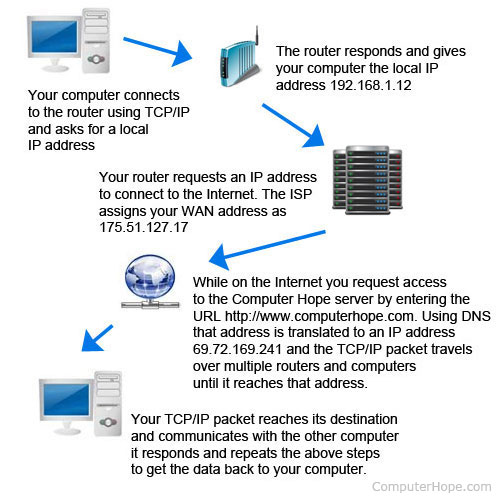

# Network troubleshooting Interview Question
### :fire:Network troubleshooting commands
* **PING**: checks the connectivity with the other computers.
* **IPCONFIG**: shows the IP address of the computer and also it shows the DNS, DHCP, Gateway addresses of the network and subnet mask.
* **NSLOOKUP**: checks domain name aliases, DNS records, operating system information by sending query to the Internet Domain Name Servers.
* **HOSTNAME**: shows you the computer name.
* **MS**: stands for milli second. The time is taken in milli second for reaching its destination.
* **NETSTAT** utility shows the protocols statistics and the current established TCP/IP connections in the computer.
* **NBTSTAT** helps to troubleshoot the NETBIOS name resolutions problems.
* **ARP** displays and modifies IP to Physical address translation table that is used by the ARP protocols.
* **Finger** command is used to retrieve the information about a user on a network.
* **TRACERT**: determine the path of the remote system. `tracert www.yahoo.com `you will see a list of all the hops and their IP addresses./**TRACEROUTE**: locating the server that is slowing down the transmission on the internet and it also shows the route between the two systems.
* **ROUTE**: allows you to make manual entries in the routing table.
```
Conmmands used to check Internet connection?
* PING servername/PING serverIP
* TRACERT servername/TRACERT serverIP
```
### :fire:Built-in tools to troubleshoot network issues.
1) Command Prompt Commands
First, ipconfig provides information about your current connection. Second, use the ping command to send a few packets of information to a remote server. others: Tracert/traceroute, Nslookup, Netstat
2) Built-In Troubleshooting Utilities
Windows contains built-in troubleshooters for common problem areas like printing, Windows Update, and audio. 

### :fire:How to Troubleshoot a Network
<details>
<summary> 1. Check the hardware.</summary>
When you’re beginning the troubleshooting process, check all your hardware to make sure it’s connected properly, turned on, and working. If a cord has come loose or somebody has switched off an important router, this could be the problem behind your networking issues. There’s no point in going through the process of troubleshooting network issues if all you need to do is plug a cord in. Make sure all switches are in the correct positions and haven’t been bumped accidentally.
Next, turn the hardware off and back on again. This is the mainstay of IT troubleshooting, and while it might sound simplistic, often it really does solve the problem. Power cycling your modem, router, and PC can solve simple issues—just be sure to leave each device off for at least 60 seconds before you turn it back on.
</details>
<details>
<summary> 2. Use ipconfig</summary>
Open the command prompt and type “ipconfig” (without the quotes) into the terminal. The Default Gateway (listed last) is your router’s IP. Your computer’s IP address is the number next to “IP Address.” If your computer’s IP address starts with 169, the computer is not receiving a valid IP address. If it starts with anything other than 169, your computer is being allocated a valid IP address from your router.
Try typing in “ipconfig /release” followed by “ipconfig /renew” to get rid of your current IP address and request a new one. This will in some cases solve the problem. If you still can’t get a valid IP from your router, try plugging your computer straight into the modem using an ethernet cable. If it works, the problem lies with the router.
</details>
<details>
<summary> 3. Use ping and tracert</summary>
If your router is working fine, and you have an IP address starting with something other than 169, the problem’s most likely located between your router and the internet. At this point, it’s time to use the ping tool. Try sending a ping to a well-known, large server, such as Google, to see if it can connect with your router. You can ping Google DNS servers by opening the command prompt and typing “ping 8.8.8.8”; you can also add “-t” to the end (ping 8.8.8.8 -t) to get it to keep pinging the servers while you troubleshoot. If the pings fail to send, the command prompt will return basic information about the issue.
You can use the tracert command to do the same thing, by typing “tracert 8.8.8.8”; this will show you each step, or “hop,” between your router and the Google DNS servers. You can see where along the pathway the error is arising. If the error comes up early along the pathway, the issue is more likely somewhere in your local network.
</details>
<details>
<summary> 4. Perform a DNS check(nslookup)</summary>
Use the command “nslookup” to determine whether there’s a problem with the server you’re trying to connect to. If you perform a DNS check on, for example, google.com and receive results such as “Timed Out,” “Server Failure,” “Refused,” “No Response from Server,” or “Network Is Unreachable,” it may indicate the problem originates in the DNS server for your destination. (You can also use nslookup to check your own DNS server.)
</details>
<details>
<summary> 5. Contact the ISP</summary>
 If all of the above turn up no problems, try contacting your internet service provider to see if they’re having issues. You can also look up outage maps and related information on a smartphone to see if others in your area are having the same problem.
</details>
<details>
<summary> 6. Check on virus and malware protection</summary>
make sure your virus and malware tools are running correctly
</details>
<details>
<summary> 7. Review database logs</summary>
Review all your database logs to make sure the databases are functioning as expected.
</details>

## :fire:Questions
<details>
<summary>If you had no connection and thr address of 169.254 what does this means and how to solve the issue? / Computer is getting wrong ip address</summary>
<br>1) Getting a 169.254.x.x address simply tells you the machine cannot reach the DHCP server over the network.
<br>2) <b>169.254.x.x</b>: This is what's called an Automatic Private IP address. An IP in this range means that the computer cannot see the network. A computer using DHCP needs to have an external server tell it what IP address to use. Unfortunately, if there's no network connectivity, the computer is unable to talk to the server. In those cases, the computer will actually give itself an IP starting with 169.254, since it must assign itself some sort of number. When you see a 169.254.x.x address, you definitely have a problem. 
<br>    It could be as simple as an unplugged network cable, or it could be as complex as the network being down. A fair amount of troubleshooting is involved at this point, but the bottom line is that your computer doesn't even see the network.
<br>3) Check your DHCP server (likely your router) for issues and remove completely your configuration for that wireless network and reboot.  Then reconnect to your wireless router.
</details>

<details>
<summary>If a server failed to do a nightly backup, what could be a reason for that? </summary>
May be due to failure or mis-configuration of NTP Server.
</details>

<details>
<summary>When and why did you use wireshark?</summary>
<bt>1) Wireshark is a free and open-source packet analyzer. It is used for network troubleshooting, analysis, software and communications protocol development, and education.
<bt>2) Wireshark can peer inside the network and examine the details of traffic at a variety of levels, ranging from connection-level information to the bits comprising a single packet. This flexibility and depth of inspection allows the valuable tool to analyze security events and troubleshoot network security device issues.
<bt>3) Wireshark captures each packet sent to or from your system.
</details>


<details>
<summary>If computer runs slow?</summary>
<br>Check task manager, antivirus, disk fragmentation. 
<br>1) One of the most common reasons for a slow computer is programs running in the background. Remove or disable any TSRs and startup programs that automatically start each time the computer boots. <b>Open Task Manager</b> to see what programs are running in the background and how much memory and CPU they are using.
<br>2) <b>Delete temp files</b>: as a computer runs programs, temporary files are stored on the hard drive. Deleting these temp files.
<br>3)If you have an <b>antivirus scanner</b> on the computer, spyware protection program, or another security utility, make sure it's not scanning your computer in the background. If a scan is in progress, it decreases the overall performance of your computer. If this is the case, allow the scan to complete, and the computer's performance should improve.
<br>4) <b>Run a disk defragment</b>
<br>5) <b>Run a disk clean-up</b>
</details>

<details>
<summary>If your computer runs slow, how to troubleshout(linux server)?</summary>
<br>1) Because of some of the following reasons:
    <br>    Many unnecessary services started or initialised at boot time by the init program
    <br>    Many RAM consuming applications such as LibreOffice on your computer
    <br>    Your (old) hard drive is malfunctioning, or its processing speed cannot keep up with the modern application
<br>2) To speed up:
    <br>     Examine CPU information: cat /proc/cpuinfo
    <br>     Check for services started at boot-time: service --status-all
    <br>     Examine CPU Load: check whether your processor/CPU is overloaded with processes. (top)
    <br>     Check for free memory space: RAM is where commonly used applications are usually stored. You can use the free command to check for memory information such as free space available for RAM and so on
    <br>     Check if your hard drive is overworking
</details>


<details>
<summary>Slow loading websites?</summary>
<br>1) <b>Clean up your website’s code.</b> Remove unnecessary elements such as white spaces, comments and inline spacing.
<br>2) <b>MySQL Server: Find slow-executing queries</b>
<br>3) <b>Speed up your site performance</b>
<br>4) <b>Check the web server</b>
<br>5) <b>check the network connection</b>: Sometimes your website might load slowly because your network connection is slow or intermittent.
<br>6) <b>Clear cookies</b>: Web browsers save cookies as files to your hard drive. They’re small in size (only a few KB), but over time, you can accumulate a lot of them. This volume means your web browser must use more and more computing power to properly load saved web pages, which means your browser sessions will likely get slower and slower.
</details>

<details>
<summary>What will you do when you type a website and website isn't coming?</summary>
<br>1) Check Your Network Connection
<br>2) Research Any Error Message in Your Browser: 403 Forbidden, 404 Page Not Found. 500 Internal Server Error
<br>3) Disable Software That Might Be Interfering: Some security software, Ad-blockers(browser extensions)...
<br>4) Try a Different Browser
<br>5) Check Your DNS: If your DNS server is slow or encountering issues, you won’t be able to access certain websites.
<br>6) Access a Cached Version of the Website
</details>

<details>
<summary>How to Fix Slow Download Speed</summary>
<br>1) Run a network speed test to determine baseline performance.
<br>2) Run <b>anti-virus software</b> on your computer to locate and eliminate harmful malware. In addition to creating harmful security holes, malware runs constantly in the background, hogging system resources and slowing connection speeds. Some malware prevents an Internet connection entirely.
<br>3) Close unneeded programs. Even if you aren't actively using a program, if it's open it's using up system resources.
<br>4) Switch from a wireless to a wired connection. In addition to offering more security than wireless, wired connections are consistently faster. 
<br>5) Reset your router and modem. Often these devices "lock up," requiring a reset to restore normal operation. Reduce the amount of streaming or downloads on your network at any given time.
</details>

<details>
<summary>How to deal with a data loss complain from a client?</summary>
</details>

<details>
<summary>I have forgotten my password, how will you help me.</summary>
<br>1) Visit Forgot Password 
<br>2) Enter either the email address or username on the account
<br>3) Select Submit
<br>4) Check your inbox for a password reset email 
<br>5) Click on the URL provided in the email and enter a new password 
</details>

<details>
<summary>Unable to connect to the internet. </summary>
<a href="https://www.russharvey.bc.ca/resources/internet.html">more details</a>
<br>1) Check the network icon (or wireless connection settings) to see if you have Internet access. Ensure that your network adapter is not turned off.
<br>2) Check for changes to proxy settings.
<br>3) Check the network cables if your computer is wired to the router.
<br>4) Reset your router.
<br>5) Check your firewall or security software. There are specific troubleshooting steps for ZoneAlarm issues.
<br>6) Check your browser access issues or email problems.
</details>

<details>
<summary>How do computers connect over the Internet?</summary>

<br>1) To connect to the Internet and other computers on a network, a computer must have a **NIC (network interface card)** installed. A network cable plugged into the NIC on one end and plugged into a cable modem, DSL modem, router, or switch can allow a computer to access the Internet and connect to other computers.
<br>2) <b>ISPs (Internet service providers)</b>: When connected to an ISP, you're assigned an IP address, which is a unique address given to your computer or network to communicate on the Internet.
<br>3) Windows, macOS, and Linux computers use the TCP/IP protocol to connect to other computers on a LAN or WAN. Connecting to a LAN or WAN requires either a wired connection or a wireless connection. A wired connection is usually done using a network cable (Cat 5 or Cat 6 network cable). A wireless connection (Wi-Fi) uses an 802.11b, 802.11g or 802.11n wireless network card. With both connection types, a network router is usually required to connect to other computers. Connecting to the Internet at your home also requires either a cable modem or a DSL modem, depending on which ISP you use.
</details>

<details>
<summary>How do I troubleshoot slow performance on AWS EC2/RDS?</summary>
<br>1) Make sure you choose the EC2 instance type based on the network speed/bandwidth, computing capacity, storage they provide. Amazon EC2 Instance Types - Amazon Web Services
<br>2) While choosing RDS, make sure the network speed/bandwidth is more. If you choose low configuration RDS instance then request and response payload could be the issue. Amazon RDS Instance Types - Amazon Web Services
<br>3) Check if there is high CPU utilization by the App service you are running on the EC2 instance. Usually, it could be because of the App which open/close multiple file descriptors unnecessarily. Its the developers mistake and should be fixed immediately.
<br>4) Check if there is high memory utilization by the App service you are running on the EC2 instance. Usually, it occurs because of some memory leak due to some unwanted looping and wrong variable handling. Its the developers mistake and should be fixed immediately.
<br>5) Implement better App Performance Monitroing (APM) agent like NewRelic to know exactly which MySQL queries are taking more time. The developers could have written a query with absolutely no brain, fix that.
</details>

<details>
<summary>A client in Germany is trying to access a server in London, but his connection is running slow. You are in Dublin. How do you diagnose his issue?</summary>
<br>1) This can be a client system issue - have the client run diagnostics on his system.
<br>2) This can be a network congestion issue between the client and server - run several trace routes and see if there is latency on any intervening connection
<br>3) This can be a server issue - see if other authorized clients are having the same or similar issues.
<br>4) Outside of these obvious ones, check the proper install of software, updates, etc. on both sides or at least the client side if you can’t get the server.
</details>

<details>
<summary>CPU usage 100%?</summary>
<br>1. End the processes that consume lots of CPU resources
<br>2. Update your drivers
<br>3. Modify Settings in Registry Editor: If you’re using Windows 10, this issue may be caused by Cortana. If you enabled Cortana, you may encounter the 100% CPU usage issue.
<br>4. Run an antivirus scan: try running an antivirus scan to see if there are viruses, spywares or Trojans on your PC.
<br>5. Disable P2P Share
<br>6. Modify Windows notification settings
</details>
